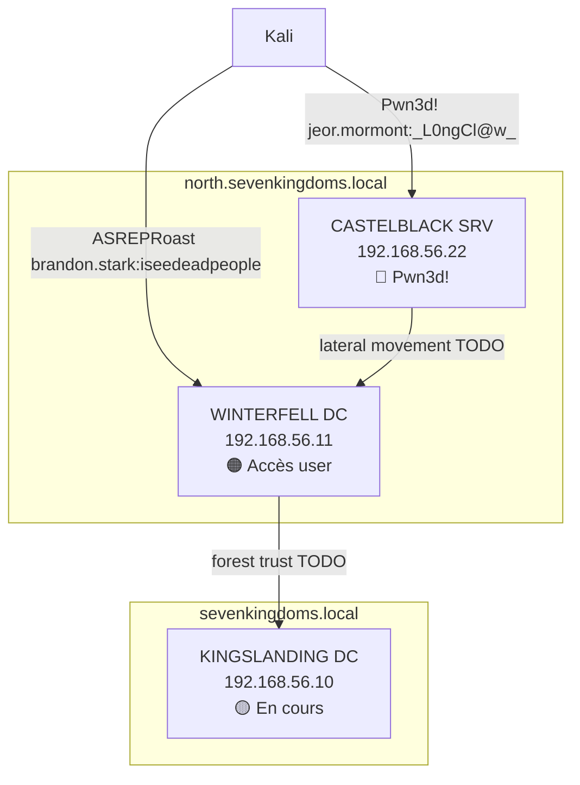

# INDEX - GOAD Pentest

**Lab :** Game Of Active Directory
**Début :** 2026-04-30
**Phase courante :** Post-Exploitation (CASTELBLACK pwn3d)

---

## Carte du réseau

---

## Phases

| # | Phase | Lien | Statut |
|---|-------|------|--------|
| 00 | Recon | [[00_recon/recon]] | ✅ done |
| 01 | Enumeration | [[01_enum/enum]] | ✅ done |
| 02 | Exploitation | [[02_exploit/exploit]] | ✅ done |
| 03 | Post-Exploitation | [[03_post_exploit/post_exploit]] | 🔄 en cours |
| 04 | Lateral Movement | — | ⏳ |
| 05 | Persistence | — | ⏳ |
| 06 | Loot | — | ⏳ |
| 07 | Report | — | ⏳ |

---

## Tableau machines

| IP | Hostname | Domaine | OS | Statut | Creds |
|----|----------|---------|----|--------|-------|
| 192.168.56.1 | Gateway | - | Ubuntu Linux | Hors scope | - |
| 192.168.56.10 | KINGSLANDING | sevenkingdoms.local | WS2019 | 🟡 En cours | - |
| 192.168.56.11 | WINTERFELL | north.sevenkingdoms.local | WS2019 | 🟠 Accès user | brandon.stark |
| 192.168.56.22 | **CASTELBLACK** | north.sevenkingdoms.local | WS2019 | 🔴 **Pwn3d!** | jeor.mormont |
| 192.168.56.100 | Inconnu | - | - | ⚫ Filtré | - |
| **10.0.2.0/24** | 🔥 Réseau caché | openstacklocal | - | 🔍 À explorer via CASTELBLACK | pivot |

---

## Tableau credentials global

| User | Password | Hash | Domaine | Méthode |
|------|----------|------|---------|---------|
| brandon.stark | `iseedeadpeople` | `$krb5asrep$23$brandon.stark@NORTH...` | north.sevenkingdoms.local | ASREPRoast |
| jeor.mormont | `_L0ngCl@w_` | - | north.sevenkingdoms.local | SYSVOL cleartext |

---

## Ports/Services clés par machine

| Port | Service | KINGSLANDING | WINTERFELL | CASTELBLACK |
|------|---------|:---:|:---:|:---:|
| 53 | DNS | ✓ | ✓ | - |
| 80 | IIS 10.0 | ✓ | - | ✓ |
| 88 | Kerberos | ✓ | ✓ | - |
| 389 | LDAP | ✓ | ✓ | - |
| 445 | SMB | signing:TRUE | signing:TRUE | **signing:FALSE 🔴** |
| 1433 | MSSQL 2019 | - | - | ✓ |
| 3389 | RDP | ✓ | ✓ | ✓ |
| 5985 | WinRM | ✓ | ✓ | ✓ 🔴 |

---

## Utilisateurs énumérés

→ [[00_recon/users.txt]] (9 users via RPC null session sur WINTERFELL)

---

## Next steps prioritaires

1. **Shell evil-winrm** sur CASTELBLACK (`jeor.mormont`)
2. **Dump SAM/LSA** sur CASTELBLACK → hashes domaine
3. **BloodHound** collection authentifiée
4. **Kerberoast `sql_svc`**
5. **Déchiffrer `secret.ps1`** (keyData AES 256 bits)
6. **NTLM relay** sur CASTELBLACK (signing FALSE)
7. **Pivot** CASTELBLACK → WINTERFELL → KINGSLANDING

---

Tags : #goad #pentest #index #recon #enum #exploit
